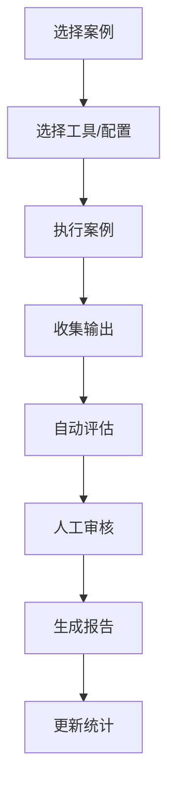
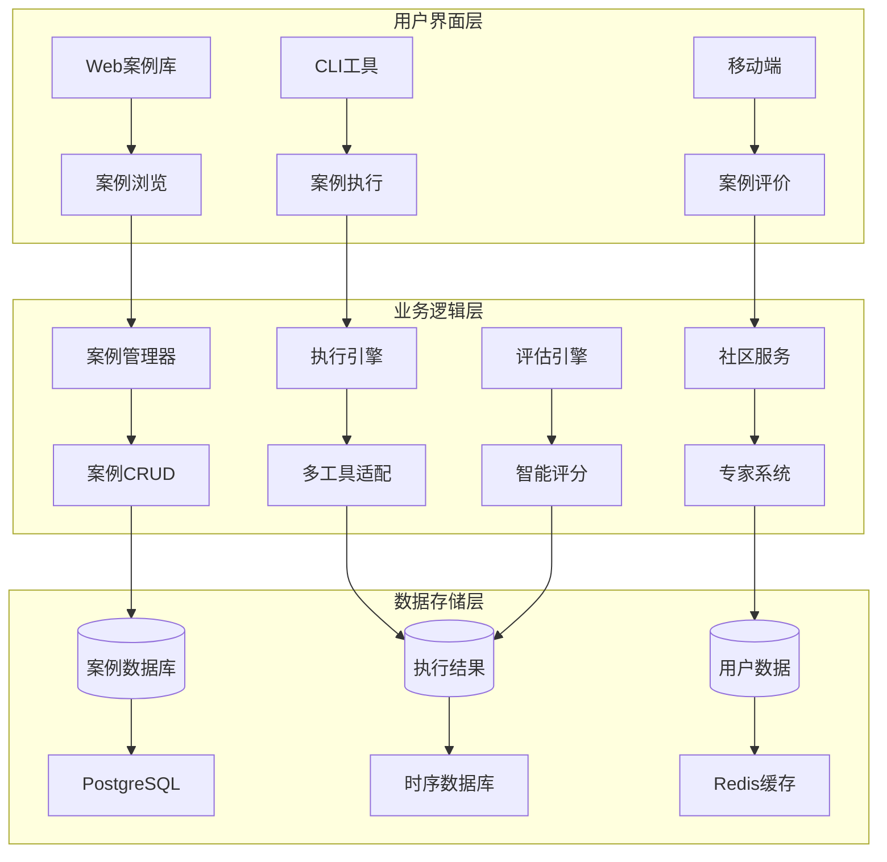

# 能力验证案例库设计文档

## 📋 概述

### 背景与定位
在AI编程工具的使用过程中，如何客观评估不同工具、模型和配置的真实能力一直是个挑战。虽然可以分享配置和一键应用，但应用效果如何验证呢？不是每个人都有合适的工作场景可以立即上手测试。

**核心洞察**：一些资深专家（大牛）往往能设计出简单而精妙的测试案例，这些案例能够很好地反映出大模型的能力边界，以及当前提示词或规则配置是否真正有价值。

### 解决方案
构建一个**专家驱动的能力验证案例库**，让社区中的专家贡献高质量的测试案例，为广大用户提供标准化的模型能力评估工具。

**核心价值**：
- 不是AI生成测试用例，而是**人类专家精心设计**的测试案例
- 简单而精妙，能有效暴露模型的能力边界
- 标准化评估体系，可客观对比不同工具和配置的效果
- 专家知识的社区化分享和传承

## 🎯 核心功能

### 1. 专家案例创建与管理

#### 案例结构设计
```typescript
interface ValidationCase {
  // 基础信息
  id: string;
  title: string;
  description: string;
  
  // 分类信息
  category: CaseCategory;        // 代码生成、逻辑推理、创意写作等
  difficulty: DifficultyLevel;   // 入门、进阶、专家、大师、传奇级
  tags: string[];               // 自由标签
  
  // 案例内容（核心）
  scenario: {
    context: string;            // 背景描述
    task: string;              // 具体任务
    input: string;             // 输入内容
    constraints?: string[];     // 约束条件
  };
  
  // 期望结果
  expected: {
    type: 'exact' | 'pattern' | 'criteria' | 'creative';
    content?: string;          // 精确匹配
    pattern?: string;          // 模式匹配  
    criteria?: string[];       // 评判标准
    examples?: string[];       // 示例答案
  };
  
  // 作者信息
  author: {
    name: string;
    expertise?: string;        // 专业领域
    reputation?: number;       // 社区声誉
  };
}
```

#### 案例分类体系
```typescript
enum CaseCategory {
  CODE_GENERATION = 'code_generation',       // 代码生成
  LOGICAL_REASONING = 'logical_reasoning',   // 逻辑推理  
  CREATIVE_WRITING = 'creative_writing',     // 创意写作
  PROBLEM_SOLVING = 'problem_solving',       // 问题解决
  TEXT_ANALYSIS = 'text_analysis',           // 文本分析
  MATH_CALCULATION = 'math_calculation',     // 数学计算
  LANGUAGE_UNDERSTANDING = 'language_understanding', // 语言理解
  DOMAIN_EXPERTISE = 'domain_expertise',     // 领域专业知识
  EDGE_CASES = 'edge_cases',                 // 边界情况
  CUSTOM = 'custom'                          // 自定义
}

enum DifficultyLevel {
  BEGINNER = 'beginner',     // 入门级：基础功能验证
  INTERMEDIATE = 'intermediate', // 进阶级：复杂场景
  ADVANCED = 'advanced',     // 专家级：深度考验
  EXPERT = 'expert',         // 大师级：极限测试
  LEGENDARY = 'legendary'    // 传奇级：神级挑战
}
```

### 2. 案例执行与评估引擎

#### 执行流程


#### 评估标准
```typescript
interface ScoringCriteria {
  accuracy: number;      // 准确性：结果正确程度
  completeness: number;  // 完整性：回答全面程度  
  creativity: number;    // 创新性：解决方案创意
  efficiency: number;    // 效率：执行速度和资源消耗
  customCriteria?: Array<{
    name: string;
    weight: number;
    description: string;
  }>;
}
```

#### 结果分析
```typescript
interface CaseExecution {
  // 执行基础信息
  caseId: string;
  tool: string;
  model?: string;
  executedAt: Date;
  duration: number;
  
  // 输出结果
  output: string;
  
  // 评分结果
  scores: {
    accuracy: number;      // 0-100
    completeness: number;  // 0-100
    creativity: number;    // 0-100
    efficiency: number;    // 0-100
    overall: number;       // 综合得分
  };
  
  // 深度分析
  analysis?: {
    strengths: string[];   // 优势分析
    weaknesses: string[];  // 不足分析
    suggestions: string[]; // 改进建议
  };
}
```

### 3. 多工具能力对比

#### 对比维度
- **跨工具对比**：同一案例在Gemini、Claude、Cursor、OpenAI上的表现
- **跨模型对比**：同一工具不同模型版本的能力差异
- **跨配置对比**：不同提示词和规则配置的效果对比
- **历史趋势**：模型能力的改进轨迹

#### 对比报告
```typescript
interface ComparisonReport {
  caseId: string;
  caseName: string;
  
  // 参与对比的工具/配置
  participants: Array<{
    id: string;
    name: string;
    tool: string;
    model?: string;
    config?: any;
  }>;
  
  // 对比结果
  results: CaseExecution[];
  
  // 分析结论
  analysis: {
    winner?: string;           // 最佳表现者
    rankings: Array<{          // 排名列表
      rank: number;
      participant: string;
      score: number;
      highlights: string[];
    }>;
    insights: string[];        // 关键洞察
    recommendations: string[]; // 使用建议
  };
  
  // 可视化数据
  charts: {
    radarChart: ChartData;     // 雷达图
    barChart: ChartData;       // 柱状图
    heatMap: ChartData;        // 热力图
  };
}
```

### 4. 社区专家系统

#### 专家认证机制
```typescript
interface ExpertProfile {
  userId: string;
  name: string;
  avatar?: string;
  
  // 专业信息
  expertise: string[];       // 专业领域
  experience: string;        // 从业经验
  credentials?: string[];    // 认证资质
  
  // 贡献统计
  contributions: {
    casesCreated: number;    // 创建案例数
    casesRated: number;      // 评价案例数
    totalDownloads: number;  // 案例下载总数
    averageRating: number;   // 平均评分
  };
  
  // 社区声誉
  reputation: {
    score: number;           // 声誉分数
    level: 'bronze' | 'silver' | 'gold' | 'platinum' | 'diamond';
    badges: string[];        // 获得徽章
  };
}
```

#### 质量控制机制
1. **专家审核**：新案例需要通过专家审核
2. **社区评分**：用户可对案例质量评分
3. **使用统计**：基于实际使用效果评估案例价值
4. **版本迭代**：支持案例的持续改进

### 5. 精选案例展示

#### 案例推荐算法
- **热门案例**：基于下载量和评分
- **新晋案例**：最近上传的高质量案例
- **专家推荐**：由认证专家推荐的案例
- **个性化推荐**：基于用户历史和偏好

#### 案例库示例

**示例1：逻辑陷阱识别**
```json
{
  "title": "自指悖论识别",
  "category": "logical_reasoning", 
  "difficulty": "advanced",
  "scenario": {
    "context": "经典的逻辑悖论测试",
    "task": "识别并解释下述语句的逻辑问题",
    "input": "这句话是假的。"
  },
  "expected": {
    "type": "criteria",
    "criteria": [
      "识别自指悖论的性质",
      "解释循环逻辑的问题",
      "提出可能的解决思路"
    ]
  }
}
```

**示例2：代码边界测试**
```json
{
  "title": "边界条件处理",
  "category": "code_generation",
  "difficulty": "expert", 
  "scenario": {
    "context": "编写一个安全的数组访问函数",
    "task": "考虑所有可能的边界情况",
    "input": "实现 safeArrayAccess(arr, index) 函数"
  },
  "expected": {
    "type": "criteria", 
    "criteria": [
      "处理空数组情况",
      "处理负索引",
      "处理越界索引", 
      "处理非数组输入",
      "提供清晰的错误处理"
    ]
  }
}
```

**示例3：创意挑战**
```json
{
  "title": "反向思维测试",
  "category": "creative_writing",
  "difficulty": "legendary",
  "scenario": {
    "context": "创意写作挑战",
    "task": "用完全相反的视角重新诠释经典童话",
    "input": "从大灰狼的角度讲述《小红帽》的故事"
  },
  "expected": {
    "type": "creative",
    "criteria": [
      "视角转换的合理性",
      "情节的创新性",
      "人物性格的重新塑造",
      "故事的完整性和逻辑性"
    ]
  }
}
```

## 🏗️ 技术架构

### 系统架构图


### 核心组件
```typescript
// 案例管理器
class CaseManager {
  async createCase(caseData: Partial<ValidationCase>): Promise<ValidationCase>;
  async getCases(filter: CaseFilter): Promise<ValidationCase[]>;
  async updateCase(caseId: string, updates: Partial<ValidationCase>): Promise<ValidationCase>;
}

// 执行引擎  
class CaseExecutor {
  async executeCase(caseId: string, tool: string, config?: any): Promise<CaseExecution>;
  async batchExecute(caseIds: string[], tools: string[]): Promise<CaseExecution[]>;
}

// 评估引擎
class ResultEvaluator {
  async evaluateResult(case: ValidationCase, output: string): Promise<Scores>;
  async compareResults(executions: CaseExecution[]): Promise<ComparisonReport>;
}

// 社区服务
class CommunityService {
  async shareCase(caseId: string): Promise<string>;
  async rateCase(caseId: string, rating: number): Promise<void>;
  async getFeaturedCases(): Promise<ValidationCase[]>;
}
```

### 数据模型
```sql
-- 验证案例表
CREATE TABLE validation_cases (
    id VARCHAR(50) PRIMARY KEY,
    title VARCHAR(200) NOT NULL,
    description TEXT,
    category VARCHAR(50) NOT NULL,
    difficulty VARCHAR(20) NOT NULL,
    scenario JSON NOT NULL,
    expected JSON NOT NULL,
    scoring JSON NOT NULL,
    author_id VARCHAR(50),
    is_public BOOLEAN DEFAULT true,
    is_certified BOOLEAN DEFAULT false,
    created_at TIMESTAMP DEFAULT CURRENT_TIMESTAMP,
    updated_at TIMESTAMP DEFAULT CURRENT_TIMESTAMP ON UPDATE CURRENT_TIMESTAMP
);

-- 案例执行表
CREATE TABLE case_executions (
    id VARCHAR(50) PRIMARY KEY,
    case_id VARCHAR(50) REFERENCES validation_cases(id),
    tool VARCHAR(50) NOT NULL,
    model VARCHAR(50),
    config JSON,
    output TEXT,
    scores JSON,
    analysis JSON,
    executed_at TIMESTAMP DEFAULT CURRENT_TIMESTAMP,
    duration INTEGER -- 执行时长(毫秒)
);

-- 专家用户表
CREATE TABLE expert_profiles (
    user_id VARCHAR(50) PRIMARY KEY,
    name VARCHAR(100) NOT NULL,
    expertise JSON,
    credentials JSON,
    reputation_score INTEGER DEFAULT 0,
    reputation_level VARCHAR(20) DEFAULT 'bronze',
    created_at TIMESTAMP DEFAULT CURRENT_TIMESTAMP
);

-- 案例评价表
CREATE TABLE case_ratings (
    id VARCHAR(50) PRIMARY KEY,
    case_id VARCHAR(50) REFERENCES validation_cases(id),
    user_id VARCHAR(50),
    rating INTEGER CHECK (rating BETWEEN 1 AND 5),
    comment TEXT,
    created_at TIMESTAMP DEFAULT CURRENT_TIMESTAMP
);
```

## 📱 用户界面设计

### CLI 命令设计
```bash
# 案例管理
meteor-shower case create --title "逻辑推理测试" --category logical_reasoning
meteor-shower case list --category code_generation --difficulty expert
meteor-shower case show <case-id>
meteor-shower case edit <case-id>

# 案例执行
meteor-shower case run <case-id> --tool gemini --config my-config
meteor-shower case batch-run <case-1> <case-2> --tools gemini,claude
meteor-shower case compare <case-id> --tools all

# 社区功能
meteor-shower case share <case-id>
meteor-shower case rate <case-id> --rating 5 --comment "excellent"
meteor-shower case featured --limit 10
meteor-shower case search "逻辑推理" --author expert-user

# 结果查看
meteor-shower case results <execution-id>
meteor-shower case report <case-id> --format pdf
meteor-shower case stats --my-cases
```

### Web UI 页面结构
```
能力验证案例库界面
├── 首页 (/)
│   ├── 精选案例轮播
│   ├── 热门分类导航  
│   ├── 专家推荐
│   └── 最新案例
├── 案例浏览 (/cases)
│   ├── 分类筛选器
│   ├── 难度筛选器
│   ├── 搜索功能
│   └── 案例卡片列表
├── 案例详情 (/cases/:id)
│   ├── 案例信息展示
│   ├── 执行历史
│   ├── 对比分析
│   └── 评论区
├── 案例执行 (/execute)
│   ├── 工具选择
│   ├── 配置设定
│   ├── 实时执行
│   └── 结果展示
├── 专家中心 (/experts)
│   ├── 专家排行榜
│   ├── 专家主页
│   ├── 贡献统计
│   └── 认证申请
├── 我的案例 (/my-cases)
│   ├── 创建的案例
│   ├── 执行历史
│   ├── 收藏夹
│   └── 统计报告
└── 创建案例 (/create)
    ├── 基础信息
    ├── 场景描述
    ├── 期望结果
    └── 评分标准
```

## 🚀 实施路线图

### 📋 总体时间安排
```
┌─────────────────────────────────────────────────────────────┐
│                    M7实施时间线 (5周)                       │
├─────────────────────────────────────────────────────────────┤
│  Week 1-2   │  Week 3    │  Week 4   │  Week 5    │  Week 6  │
├─────────────────────────────────────────────────────────────┤
│  Phase 1    │  Phase 2   │  Phase 3  │  Phase 4   │  集成测试 │
│  核心案例   │  执行引擎  │  社区功能 │  UI完善   │  &上线准备 │
│  管理       │  与评估    │           │ 与高级功能 │           │
└─────────────────────────────────────────────────────────────┘
```

### Phase 1: 核心案例管理 (2周)
**优先级**: 高 | **负责人**: 后端开发团队 | **预计时间**: 2周

#### 🎯 目标
建立案例管理的核心功能，实现案例的完整生命周期管理

#### 📋 具体任务清单
**Week 1 任务**:
- [ ] **案例数据模型设计**
  - 实现完整的 `ValidationCase` 接口和类型定义
  - 设计案例分类枚举 `CaseCategory`（10个类别）
  - 设计难度等级枚举 `DifficultyLevel`（5个等级）
  - 设计案例状态枚举（草稿、审核中、已发布、下架）
  - 设计案例元数据结构（标签、作者、版本等）

- [ ] **CaseManager核心类**
  - 实现案例创建功能，支持所有字段验证
  - 实现案例查询功能，支持多条件筛选
  - 实现案例更新功能，支持部分字段修改
  - 实现案例删除功能，支持软删除机制
  - 实现案例版本控制和历史记录

- [ ] **分类和标签系统**
  - 实现分类管理功能（增删改查分类）
  - 实现标签管理功能（自动标签提取、手动标签管理）
  - 实现分类层级结构（主分类+子分类）
  - 实现标签权重和热度统计
  - 实现分类和标签的国际化支持

- [ ] **基础CLI命令**
  - 实现 `meteor-shower case create` 命令
  - 实现 `meteor-shower case list` 命令
  - 实现 `meteor-shower case show` 命令
  - 实现 `meteor-shower case edit` 命令
  - 实现 `meteor-shower case delete` 命令

- [ ] **基础Web UI**
  - 实现案例列表页面，支持分页和排序
  - 实现案例详情页面，展示完整案例信息
  - 实现案例创建表单，包含所有必要字段
  - 实现案例编辑界面，支持富文本编辑
  - 实现基础搜索功能（按标题、标签、作者）

**Week 2 任务**:
- [ ] **质量控制机制**
  - 实现案例验证器，检查必填字段和格式
  - 实现案例质量评分算法（基于完整性、创新性等）
  - 实现重复案例检测机制
  - 实现敏感内容过滤器
  - 实现案例审核流程（自动审核+人工审核）

- [ ] **搜索和筛选系统**
  - 实现全文搜索功能（标题、描述、内容）
  - 实现多维度筛选（分类、难度、标签、作者）
  - 实现排序功能（热度、评分、时间、下载量）
  - 实现搜索结果高亮显示
  - 实现搜索建议和自动补全

- [ ] **版本管理功能**
  - 实现案例版本控制系统
  - 实现版本对比和差异显示
  - 实现版本回滚功能
  - 实现版本注释和变更记录
  - 实现版本分支管理（用于实验性修改）

- [ ] **导入导出功能**
  - 实现JSON格式案例导入导出
  - 实现CSV格式批量导入
  - 实现PDF格式案例报告导出
  - 实现Excel格式数据统计导出
  - 实现API批量导入接口

- [ ] **单元测试覆盖**
  - 为CaseManager编写完整单元测试
  - 为分类和标签系统编写测试用例
  - 为搜索和筛选功能编写测试
  - 为版本管理功能编写测试
  - 实现集成测试和端到端测试

#### 🏆 里程碑
- **Day 7**: 完成数据模型和CaseManager基础功能
- **Day 14**: 完成质量控制、搜索和单元测试

#### 🔗 依赖关系
- 依赖现有CLI框架和数据库模块
- 需要JSON Schema验证库支持
- 需要全文搜索库支持（可选择Elasticsearch或内置解决方案）

#### ⚠️ 风险评估
- **技术风险**: 中等 - 需要处理复杂的案例数据结构和搜索功能
- **数据质量风险**: 高 - 案例质量直接影响系统价值，需要严格的质量控制
- **扩展性风险**: 中等 - 需要支持未来新增的能力类别和评估维度
- **性能风险**: 中等 - 搜索功能需要性能优化以支持大量案例

#### ✅ 成功标准
- [ ] 案例数据模型支持所有预定义字段和类型
- [ ] CRUD操作响应时间<200ms，支持高并发
- [ ] 分类体系完整可用，支持10个预定义类别
- [ ] CLI命令功能完整，用户体验良好
- [ ] 搜索功能准确率>95%，响应时间<1秒
- [ ] 单元测试覆盖率达到90%以上

### Phase 2: 执行引擎与评估 (1周)
**优先级**: 高 | **负责人**: AI集成团队 | **预计时间**: 1周

#### 🎯 目标
实现案例执行和智能评估的核心引擎，支持多工具能力验证

#### 📋 具体任务清单
**Week 3 任务**:
- [ ] **CaseExecutor执行引擎**
  - 集成现有AI工具适配器（Gemini、Claude、Cursor、OpenAI）
  - 实现案例输入格式转换和参数注入
  - 实现执行结果收集和格式标准化
  - 实现执行超时和错误处理机制
  - 实现执行历史记录和状态跟踪

- [ ] **ResultEvaluator评估引擎**
  - 实现准确性评估算法（与期望结果对比）
  - 实现完整性评估算法（任务完成程度检查）
  - 实现创新性评估算法（解决方案创意程度）
  - 实现效率评估算法（响应时间和资源使用）
  - 实现自定义评估标准支持

- [ ] **对比分析功能**
  - 实现跨工具对比分析引擎
  - 实现跨模型对比分析功能
  - 实现跨配置对比分析能力
  - 实现历史趋势分析和可视化
  - 实现对比报告生成和导出

- [ ] **执行结果存储**
  - 设计执行结果数据结构和表设计
  - 实现执行结果持久化存储
  - 实现执行历史查询和统计
  - 实现结果缓存机制优化性能
  - 实现结果清理和归档策略

- [ ] **批量执行支持**
  - 实现批量案例执行引擎
  - 实现执行队列管理和调度
  - 实现执行进度跟踪和报告
  - 实现批量执行结果汇总分析
  - 实现执行失败重试机制

#### 🏆 里程碑
- **Day 21**: 完成执行引擎和评估系统的核心功能

#### 🔗 依赖关系
- 依赖Phase 1的案例数据模型和CaseManager
- 依赖现有AI工具适配器（packages/adapters）
- 需要缓存库支持（Redis推荐）
- 需要队列系统支持（Bull或类似）

#### ⚠️ 风险评估
- **AI服务稳定性风险**: 高 - 依赖外部AI服务可用性和性能
- **评分算法准确性风险**: 中等 - 评估算法需要不断优化和验证
- **性能风险**: 中等 - 多工具并发执行需要性能优化
- **扩展性风险**: 中等 - 需要支持未来新增的AI工具和模型

#### ✅ 成功标准
- [ ] 多工具执行功能正常，支持所有预定义AI工具
- [ ] 评估算法给出合理评分，结果可解释
- [ ] 对比分析报告清晰有用，提供 actionable insights
- [ ] 执行结果正确存储，支持高效查询
- [ ] 批量执行稳定，支持>10个并发任务

### Phase 3: 社区功能 (1周)
**优先级**: 中 | **负责人**: 社区开发团队 | **预计时间**: 1周

#### 🎯 目标
建立专家认证和社区评价机制，促进高质量案例的产生和传播

#### 📋 具体任务清单
**Week 4 任务**:
- [ ] **CommunityService社区服务**
  - 实现案例分享功能和社会化传播
  - 实现案例收藏和书签功能
  - 实现案例使用统计和热度跟踪
  - 实现社区活动和贡献排行榜
  - 实现社区公告和更新通知

- [ ] **专家认证系统**
  - 实现专家档案管理（个人信息、专业领域、证书）
  - 实现贡献积分系统（案例创建、评价、改进）
  - 实现专家等级体系（青铜、白银、黄金、白金、钻石）
  - 实现专家认证审核流程
  - 实现专家专属功能和权限

- [ ] **案例评分和评论**
  - 实现五星评价系统
  - 实现详细评论和反馈功能
  - 实现评论审核和质量控制
  - 实现评论有用性投票机制
  - 实现评论排序和筛选功能

- [ ] **推荐算法实现**
  - 实现基于用户兴趣的个性化推荐
  - 实现基于能力水平的难度推荐
  - 实现基于历史行为的协同过滤推荐
  - 实现热门和精选案例推荐
  - 实现相关案例推荐算法

- [ ] **社区质量控制**
  - 实现新案例审核流程（自动+人工）
  - 实现低质量案例下架机制
  - 实现专家审核和批准流程
  - 实现社区举报和处理机制
  - 实现案例质量持续改进机制

#### 🏆 里程碑
- **Day 28**: 完成社区功能和质量控制机制

#### 🔗 依赖关系
- 依赖Phase 1的案例数据模型和用户系统
- 需要推荐算法库支持（可使用简单的协同过滤）
- 需要通知系统支持（可与observability模块集成）

#### ⚠️ 风险评估
- **社区活跃度风险**: 中等 - 需要足够专家参与贡献高质量案例
- **质量控制风险**: 高 - 需要平衡开放性和质量要求
- **推荐算法风险**: 中等 - 推荐准确性需要数据和算法优化
- **审核效率风险**: 中等 - 人工审核可能成为瓶颈

#### ✅ 成功标准
- [ ] 专家认证体系正常运作，支持等级和积分机制
- [ ] 用户可以正常评价和评论案例，互动活跃
- [ ] 推荐算法提供有用建议，点击率>15%
- [ ] 质量控制流程有效执行，新案例审核及时
- [ ] 社区功能促进专家参与，贡献者数量稳定增长

### Phase 4: UI界面与高级功能 (1周)
**优先级**: 中 | **负责人**: 前端开发团队 | **预计时间**: 1周

#### 🎯 目标
提供完整直观的用户界面和高级数据分析功能

#### 📋 具体任务清单
**Week 5 任务**:
- [ ] **完整Web UI实现**
  - 实现案例浏览和搜索界面
  - 实现案例创建和编辑界面（富文本编辑器）
  - 实现案例执行和结果展示界面
  - 实现专家中心和排行榜界面
  - 实现个人中心和贡献统计界面

- [ ] **数据可视化功能**
  - 实现雷达图展示多维度评分
  - 实现柱状图展示工具对比结果
  - 实现趋势图展示历史表现变化
  - 实现热力图展示能力分布情况
  - 实现仪表盘展示关键指标概览

- [ ] **高级搜索和过滤**
  - 实现多条件组合搜索界面
  - 实现分类和标签的树形筛选器
  - 实现难度和评分的范围筛选
  - 实现作者和时间的复合筛选
  - 实现搜索历史和保存的筛选条件

- [ ] **个性化推荐界面**
  - 实现推荐案例展示组件
  - 实现推荐理由说明和透明度
  - 实现推荐反馈机制（有用/不感兴趣）
  - 实现个性化设置界面
  - 实现推荐算法调优接口

- [ ] **移动端响应式设计**
  - 实现移动端友好的界面布局
  - 实现触摸友好的交互设计
  - 实现移动端优化的搜索体验
  - 实现移动端推送通知支持
  - 实现离线阅读和缓存功能

#### 🏆 里程碑
- **Day 35**: 完成UI界面和高级功能开发

#### 🔗 依赖关系
- 依赖Phase 2的执行引擎和评估系统
- 需要前端框架和可视化库（Chart.js、D3.js）
- 需要响应式设计框架支持
- 需要富文本编辑器库支持

#### ⚠️ 风险评估
- **用户体验风险**: 中等 - 界面设计直接影响用户使用效率和满意度
- **性能风险**: 中等 - 可视化功能需要性能优化
- **兼容性风险**: 低 - 使用成熟的前端技术栈
- **移动端适配风险**: 中等 - 需要适配多种设备和屏幕尺寸

#### ✅ 成功标准
- [ ] Web界面功能完整，用户体验流畅
- [ ] 数据可视化清晰直观，提供有用洞察
- [ ] 高级搜索功能强大，支持复杂查询需求
- [ ] 个性化推荐准确有效，用户接受度高
- [ ] 移动端体验良好，支持主流设备和浏览器

### Phase 5: 集成测试与上线准备 (1周)
**优先级**: 高 | **负责人**: 测试与运维团队 | **预计时间**: 1周

#### 🎯 目标
确保系统稳定性和可靠性，为生产环境部署做好准备

#### 📋 具体任务清单
**Week 6 任务**:
- [ ] **集成测试**
  - 实现模块间接口测试
  - 实现完整工作流端到端测试
  - 实现多用户并发测试
  - 实现数据库迁移测试
  - 实现备份恢复测试

- [ ] **性能测试**
  - 实现大批量案例导入性能测试
  - 实现高并发执行性能测试
  - 实现搜索功能性能测试
  - 实现数据库查询性能优化
  - 实现缓存策略效果验证

- [ ] **安全测试**
  - 实现SQL注入防护测试
  - 实现XSS攻击防护测试
  - 实现CSRF防护测试
  - 实现敏感数据加密测试
  - 实现访问控制权限测试

- [ ] **用户验收测试**
  - 准备UAT测试环境
  - 编写用户操作手册
  - 收集用户反馈和bug报告
  - 修复发现的问题和改进点
  - 确认用户验收标准达成

- [ ] **部署准备**
  - 编写部署文档和脚本
  - 配置生产环境参数
  - 设置监控和告警规则
  - 准备数据迁移方案
  - 制定回滚计划和应急预案

#### 🏆 里程碑
- **Day 42**: 完成所有测试和部署准备工作

#### 🔗 依赖关系
- 依赖所有前序阶段的完成
- 需要测试框架和工具支持
- 需要监控系统支持（可与observability模块集成）

#### ⚠️ 风险评估
- **集成风险**: 中等 - 模块间接口需要充分测试
- **性能风险**: 中等 - 高负载场景需要性能验证
- **安全风险**: 高 - 需要确保生产环境安全性
- **部署风险**: 中等 - 需要确保部署过程平稳

#### ✅ 成功标准
- [ ] 集成测试通过率>95%，无严重缺陷
- [ ] 性能测试满足预定义指标（响应时间、吞吐量）
- [ ] 安全测试通过所有检查，无漏洞风险
- [ ] 用户验收测试获得通过，用户满意度高
- [ ] 部署准备完成，支持一键部署和回滚

## 📊 预期价值

### 对用户的价值
1. **客观评估**：提供标准化的模型能力评估基准
2. **配置优化**：通过测试案例验证配置效果，优化使用策略
3. **学习提升**：学习专家设计的精妙案例，提升对AI能力的理解
4. **决策支持**：基于客观数据选择最适合的工具和配置

### 对社区的价值
1. **知识共享**：专家知识的社区化分享和传承
2. **标准建立**：建立行业认可的AI能力评估标准
3. **持续改进**：通过社区反馈不断优化案例质量
4. **生态繁荣**：促进AI工具和配置的良性竞争

### 成功指标
- **案例数量**：目标1000+高质量案例
- **专家参与**：目标100+认证专家贡献
- **执行次数**：月执行量10000+次
- **用户满意度**：案例平均评分4.5+/5.0
- **覆盖度**：覆盖10+主要AI能力类别

---

**文档状态**：草案  
**版本**：1.0.0  
**创建日期**：2024-09-26  
**模块定位**：M6阶段核心功能