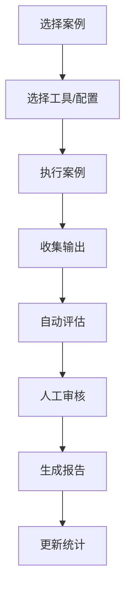
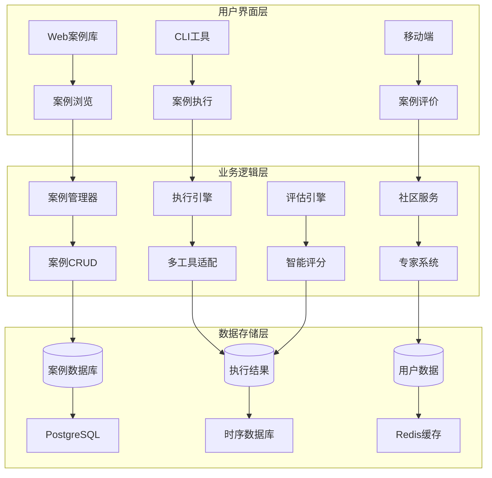

# 能力验证案例库设计文档

## 📋 概述

### 背景与定位
在AI编程工具的使用过程中，如何客观评估不同工具、模型和配置的真实能力一直是个挑战。虽然可以分享配置和一键应用，但应用效果如何验证呢？不是每个人都有合适的工作场景可以立即上手测试。

**核心洞察**：一些资深专家（大牛）往往能设计出简单而精妙的测试案例，这些案例能够很好地反映出大模型的能力边界，以及当前提示词或规则配置是否真正有价值。

### 解决方案
构建一个**专家驱动的能力验证案例库**，让社区中的专家贡献高质量的测试案例，为广大用户提供标准化的模型能力评估工具。

**核心价值**：
- 不是AI生成测试用例，而是**人类专家精心设计**的测试案例
- 简单而精妙，能有效暴露模型的能力边界
- 标准化评估体系，可客观对比不同工具和配置的效果
- 专家知识的社区化分享和传承

## 🎯 核心功能

### 1. 专家案例创建与管理

#### 案例结构设计
```typescript
interface ValidationCase {
  // 基础信息
  id: string;
  title: string;
  description: string;
  
  // 分类信息
  category: CaseCategory;        // 代码生成、逻辑推理、创意写作等
  difficulty: DifficultyLevel;   // 入门、进阶、专家、大师、传奇级
  tags: string[];               // 自由标签
  
  // 案例内容（核心）
  scenario: {
    context: string;            // 背景描述
    task: string;              // 具体任务
    input: string;             // 输入内容
    constraints?: string[];     // 约束条件
  };
  
  // 期望结果
  expected: {
    type: 'exact' | 'pattern' | 'criteria' | 'creative';
    content?: string;          // 精确匹配
    pattern?: string;          // 模式匹配  
    criteria?: string[];       // 评判标准
    examples?: string[];       // 示例答案
  };
  
  // 作者信息
  author: {
    name: string;
    expertise?: string;        // 专业领域
    reputation?: number;       // 社区声誉
  };
}
```

#### 案例分类体系
```typescript
enum CaseCategory {
  CODE_GENERATION = 'code_generation',       // 代码生成
  LOGICAL_REASONING = 'logical_reasoning',   // 逻辑推理  
  CREATIVE_WRITING = 'creative_writing',     // 创意写作
  PROBLEM_SOLVING = 'problem_solving',       // 问题解决
  TEXT_ANALYSIS = 'text_analysis',           // 文本分析
  MATH_CALCULATION = 'math_calculation',     // 数学计算
  LANGUAGE_UNDERSTANDING = 'language_understanding', // 语言理解
  DOMAIN_EXPERTISE = 'domain_expertise',     // 领域专业知识
  EDGE_CASES = 'edge_cases',                 // 边界情况
  CUSTOM = 'custom'                          // 自定义
}

enum DifficultyLevel {
  BEGINNER = 'beginner',     // 入门级：基础功能验证
  INTERMEDIATE = 'intermediate', // 进阶级：复杂场景
  ADVANCED = 'advanced',     // 专家级：深度考验
  EXPERT = 'expert',         // 大师级：极限测试
  LEGENDARY = 'legendary'    // 传奇级：神级挑战
}
```

### 2. 案例执行与评估引擎

#### 执行流程


#### 评估标准
```typescript
interface ScoringCriteria {
  accuracy: number;      // 准确性：结果正确程度
  completeness: number;  // 完整性：回答全面程度  
  creativity: number;    // 创新性：解决方案创意
  efficiency: number;    // 效率：执行速度和资源消耗
  customCriteria?: Array<{
    name: string;
    weight: number;
    description: string;
  }>;
}
```

#### 结果分析
```typescript
interface CaseExecution {
  // 执行基础信息
  caseId: string;
  tool: string;
  model?: string;
  executedAt: Date;
  duration: number;
  
  // 输出结果
  output: string;
  
  // 评分结果
  scores: {
    accuracy: number;      // 0-100
    completeness: number;  // 0-100
    creativity: number;    // 0-100
    efficiency: number;    // 0-100
    overall: number;       // 综合得分
  };
  
  // 深度分析
  analysis?: {
    strengths: string[];   // 优势分析
    weaknesses: string[];  // 不足分析
    suggestions: string[]; // 改进建议
  };
}
```

### 3. 多工具能力对比

#### 对比维度
- **跨工具对比**：同一案例在Gemini、Claude、Cursor、OpenAI上的表现
- **跨模型对比**：同一工具不同模型版本的能力差异
- **跨配置对比**：不同提示词和规则配置的效果对比
- **历史趋势**：模型能力的改进轨迹

#### 对比报告
```typescript
interface ComparisonReport {
  caseId: string;
  caseName: string;
  
  // 参与对比的工具/配置
  participants: Array<{
    id: string;
    name: string;
    tool: string;
    model?: string;
    config?: any;
  }>;
  
  // 对比结果
  results: CaseExecution[];
  
  // 分析结论
  analysis: {
    winner?: string;           // 最佳表现者
    rankings: Array<{          // 排名列表
      rank: number;
      participant: string;
      score: number;
      highlights: string[];
    }>;
    insights: string[];        // 关键洞察
    recommendations: string[]; // 使用建议
  };
  
  // 可视化数据
  charts: {
    radarChart: ChartData;     // 雷达图
    barChart: ChartData;       // 柱状图
    heatMap: ChartData;        // 热力图
  };
}
```

### 4. 社区专家系统

#### 专家认证机制
```typescript
interface ExpertProfile {
  userId: string;
  name: string;
  avatar?: string;
  
  // 专业信息
  expertise: string[];       // 专业领域
  experience: string;        // 从业经验
  credentials?: string[];    // 认证资质
  
  // 贡献统计
  contributions: {
    casesCreated: number;    // 创建案例数
    casesRated: number;      // 评价案例数
    totalDownloads: number;  // 案例下载总数
    averageRating: number;   // 平均评分
  };
  
  // 社区声誉
  reputation: {
    score: number;           // 声誉分数
    level: 'bronze' | 'silver' | 'gold' | 'platinum' | 'diamond';
    badges: string[];        // 获得徽章
  };
}
```

#### 质量控制机制
1. **专家审核**：新案例需要通过专家审核
2. **社区评分**：用户可对案例质量评分
3. **使用统计**：基于实际使用效果评估案例价值
4. **版本迭代**：支持案例的持续改进

### 5. 精选案例展示

#### 案例推荐算法
- **热门案例**：基于下载量和评分
- **新晋案例**：最近上传的高质量案例
- **专家推荐**：由认证专家推荐的案例
- **个性化推荐**：基于用户历史和偏好

#### 案例库示例

**示例1：逻辑陷阱识别**
```json
{
  "title": "自指悖论识别",
  "category": "logical_reasoning", 
  "difficulty": "advanced",
  "scenario": {
    "context": "经典的逻辑悖论测试",
    "task": "识别并解释下述语句的逻辑问题",
    "input": "这句话是假的。"
  },
  "expected": {
    "type": "criteria",
    "criteria": [
      "识别自指悖论的性质",
      "解释循环逻辑的问题",
      "提出可能的解决思路"
    ]
  }
}
```

**示例2：代码边界测试**
```json
{
  "title": "边界条件处理",
  "category": "code_generation",
  "difficulty": "expert", 
  "scenario": {
    "context": "编写一个安全的数组访问函数",
    "task": "考虑所有可能的边界情况",
    "input": "实现 safeArrayAccess(arr, index) 函数"
  },
  "expected": {
    "type": "criteria", 
    "criteria": [
      "处理空数组情况",
      "处理负索引",
      "处理越界索引", 
      "处理非数组输入",
      "提供清晰的错误处理"
    ]
  }
}
```

**示例3：创意挑战**
```json
{
  "title": "反向思维测试",
  "category": "creative_writing",
  "difficulty": "legendary",
  "scenario": {
    "context": "创意写作挑战",
    "task": "用完全相反的视角重新诠释经典童话",
    "input": "从大灰狼的角度讲述《小红帽》的故事"
  },
  "expected": {
    "type": "creative",
    "criteria": [
      "视角转换的合理性",
      "情节的创新性",
      "人物性格的重新塑造",
      "故事的完整性和逻辑性"
    ]
  }
}
```

## 🏗️ 技术架构

### 系统架构图


### 核心组件
```typescript
// 案例管理器
class CaseManager {
  async createCase(caseData: Partial<ValidationCase>): Promise<ValidationCase>;
  async getCases(filter: CaseFilter): Promise<ValidationCase[]>;
  async updateCase(caseId: string, updates: Partial<ValidationCase>): Promise<ValidationCase>;
}

// 执行引擎  
class CaseExecutor {
  async executeCase(caseId: string, tool: string, config?: any): Promise<CaseExecution>;
  async batchExecute(caseIds: string[], tools: string[]): Promise<CaseExecution[]>;
}

// 评估引擎
class ResultEvaluator {
  async evaluateResult(case: ValidationCase, output: string): Promise<Scores>;
  async compareResults(executions: CaseExecution[]): Promise<ComparisonReport>;
}

// 社区服务
class CommunityService {
  async shareCase(caseId: string): Promise<string>;
  async rateCase(caseId: string, rating: number): Promise<void>;
  async getFeaturedCases(): Promise<ValidationCase[]>;
}
```

### 数据模型
```sql
-- 验证案例表
CREATE TABLE validation_cases (
    id VARCHAR(50) PRIMARY KEY,
    title VARCHAR(200) NOT NULL,
    description TEXT,
    category VARCHAR(50) NOT NULL,
    difficulty VARCHAR(20) NOT NULL,
    scenario JSON NOT NULL,
    expected JSON NOT NULL,
    scoring JSON NOT NULL,
    author_id VARCHAR(50),
    is_public BOOLEAN DEFAULT true,
    is_certified BOOLEAN DEFAULT false,
    created_at TIMESTAMP DEFAULT CURRENT_TIMESTAMP,
    updated_at TIMESTAMP DEFAULT CURRENT_TIMESTAMP ON UPDATE CURRENT_TIMESTAMP
);

-- 案例执行表
CREATE TABLE case_executions (
    id VARCHAR(50) PRIMARY KEY,
    case_id VARCHAR(50) REFERENCES validation_cases(id),
    tool VARCHAR(50) NOT NULL,
    model VARCHAR(50),
    config JSON,
    output TEXT,
    scores JSON,
    analysis JSON,
    executed_at TIMESTAMP DEFAULT CURRENT_TIMESTAMP,
    duration INTEGER -- 执行时长(毫秒)
);

-- 专家用户表
CREATE TABLE expert_profiles (
    user_id VARCHAR(50) PRIMARY KEY,
    name VARCHAR(100) NOT NULL,
    expertise JSON,
    credentials JSON,
    reputation_score INTEGER DEFAULT 0,
    reputation_level VARCHAR(20) DEFAULT 'bronze',
    created_at TIMESTAMP DEFAULT CURRENT_TIMESTAMP
);

-- 案例评价表
CREATE TABLE case_ratings (
    id VARCHAR(50) PRIMARY KEY,
    case_id VARCHAR(50) REFERENCES validation_cases(id),
    user_id VARCHAR(50),
    rating INTEGER CHECK (rating BETWEEN 1 AND 5),
    comment TEXT,
    created_at TIMESTAMP DEFAULT CURRENT_TIMESTAMP
);
```

## 📱 用户界面设计

### CLI 命令设计
```bash
# 案例管理
meteor-shower case create --title "逻辑推理测试" --category logical_reasoning
meteor-shower case list --category code_generation --difficulty expert
meteor-shower case show <case-id>
meteor-shower case edit <case-id>

# 案例执行
meteor-shower case run <case-id> --tool gemini --config my-config
meteor-shower case batch-run <case-1> <case-2> --tools gemini,claude
meteor-shower case compare <case-id> --tools all

# 社区功能
meteor-shower case share <case-id>
meteor-shower case rate <case-id> --rating 5 --comment "excellent"
meteor-shower case featured --limit 10
meteor-shower case search "逻辑推理" --author expert-user

# 结果查看
meteor-shower case results <execution-id>
meteor-shower case report <case-id> --format pdf
meteor-shower case stats --my-cases
```

### Web UI 页面结构
```
能力验证案例库界面
├── 首页 (/)
│   ├── 精选案例轮播
│   ├── 热门分类导航  
│   ├── 专家推荐
│   └── 最新案例
├── 案例浏览 (/cases)
│   ├── 分类筛选器
│   ├── 难度筛选器
│   ├── 搜索功能
│   └── 案例卡片列表
├── 案例详情 (/cases/:id)
│   ├── 案例信息展示
│   ├── 执行历史
│   ├── 对比分析
│   └── 评论区
├── 案例执行 (/execute)
│   ├── 工具选择
│   ├── 配置设定
│   ├── 实时执行
│   └── 结果展示
├── 专家中心 (/experts)
│   ├── 专家排行榜
│   ├── 专家主页
│   ├── 贡献统计
│   └── 认证申请
├── 我的案例 (/my-cases)
│   ├── 创建的案例
│   ├── 执行历史
│   ├── 收藏夹
│   └── 统计报告
└── 创建案例 (/create)
    ├── 基础信息
    ├── 场景描述
    ├── 期望结果
    └── 评分标准
```

## 🚀 实施路线图

### Phase 1: 核心案例管理（2周）
- [ ] **Week 1**
  - [ ] 案例数据模型设计
  - [ ] CaseManager 基础CRUD功能
  - [ ] 案例分类和标签系统
  - [ ] 基础 CLI 命令实现
  - [ ] 简单的 Web UI（案例列表、详情）

- [ ] **Week 2**
  - [ ] 案例验证和质量控制
  - [ ] 搜索和筛选功能
  - [ ] 案例版本管理
  - [ ] 导入导出功能
  - [ ] 单元测试覆盖

### Phase 2: 执行引擎和评估（1周）
- [ ] **Week 3**
  - [ ] CaseExecutor 多工具执行引擎
  - [ ] ResultEvaluator 智能评分系统
  - [ ] 对比分析功能
  - [ ] 执行结果存储和查询
  - [ ] 批量执行支持

### Phase 3: 社区功能（1周）
- [ ] **Week 4**  
  - [ ] CommunityService 社区服务
  - [ ] 专家认证系统
  - [ ] 案例评分和评论
  - [ ] 推荐算法实现
  - [ ] 社区排行榜

### Phase 4: UI完善和高级功能（1周）
- [ ] **Week 5**
  - [ ] 完整的 Web UI 实现
  - [ ] 数据可视化（图表、报告）
  - [ ] 高级搜索和过滤
  - [ ] 个性化推荐
  - [ ] 移动端响应式设计

## 📊 预期价值

### 对用户的价值
1. **客观评估**：提供标准化的模型能力评估基准
2. **配置优化**：通过测试案例验证配置效果，优化使用策略
3. **学习提升**：学习专家设计的精妙案例，提升对AI能力的理解
4. **决策支持**：基于客观数据选择最适合的工具和配置

### 对社区的价值
1. **知识共享**：专家知识的社区化分享和传承
2. **标准建立**：建立行业认可的AI能力评估标准
3. **持续改进**：通过社区反馈不断优化案例质量
4. **生态繁荣**：促进AI工具和配置的良性竞争

### 成功指标
- **案例数量**：目标1000+高质量案例
- **专家参与**：目标100+认证专家贡献
- **执行次数**：月执行量10000+次
- **用户满意度**：案例平均评分4.5+/5.0
- **覆盖度**：覆盖10+主要AI能力类别

---

**文档状态**：草案  
**版本**：1.0.0  
**创建日期**：2024-09-26  
**模块定位**：M6阶段核心功能