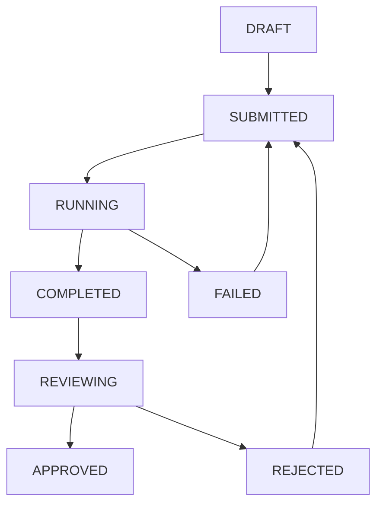

# 任务协调管理模块设计文档

## 📋 概述

### 背景与痛点
在与AI编程工具协作中，存在明显的异步性和管理挑战：

**现实场景：**
- **编写阶段**：人类花费1-几分钟编写需求
- **执行阶段**：AI工具需要几分钟到几十分钟执行
- **检查阶段**：人类检查结果，决定下一步

**核心痛点：**
1. **多任务并行困难**：启动A、B、C、D任务，当D发出时A可能已完成
2. **状态跟踪分散**：不同工具提醒机制不统一
3. **上下文切换成本高**：频繁在工具间切换
4. **工作碎片化**：缺乏统一的优先级管理

### 解决方案
作为外挂协调层，提供：
- 统一任务管理
- 智能调度
- 聚合通知
- 工作流优化

## 🎯 核心功能

### 1. 任务生命周期管理

#### 任务状态模型
```typescript
enum TaskStatus {
  DRAFT = 'draft',           // 草稿
  SUBMITTED = 'submitted',   // 已提交
  RUNNING = 'running',       // 执行中
  COMPLETED = 'completed',   // 已完成
  REVIEWING = 'reviewing',   // 检查中
  APPROVED = 'approved',     // 已通过
  REJECTED = 'rejected',     // 已拒绝
  CANCELLED = 'cancelled',   // 已取消
  FAILED = 'failed'          // 执行失败
}

interface Task {
  id: string;
  title: string;
  description: string;
  tool: 'gemini' | 'claude' | 'cursor' | 'openai';
  prompt: string;
  status: TaskStatus;
  priority: 'low' | 'medium' | 'high' | 'urgent';
  dependencies?: string[];
  createdAt: Date;
  estimatedDuration?: number;
  actualDuration?: number;
  output?: any;
  rating?: number;
}
```

#### 状态流转图


### 2. 跨工具任务监控

#### 工具适配器接口
```typescript
interface ToolAdapter {
  submitTask(task: Task): Promise<string>;
  getTaskStatus(toolTaskId: string): Promise<TaskStatusInfo>;
  cancelTask(toolTaskId: string): Promise<boolean>;
  getTaskResult(toolTaskId: string): Promise<TaskResult>;
}

class TaskMonitor {
  private adapters: Map<string, ToolAdapter> = new Map();
  private activeTasks: Map<string, MonitoredTask> = new Map();
  
  async startMonitoring(task: Task): Promise<void> {
    const adapter = this.adapters.get(task.tool);
    const toolTaskId = await adapter.submitTask(task);
    
    this.activeTasks.set(task.id, { task, toolTaskId, adapter });
    this.schedulePolling(task.id);
  }
  
  private async pollTaskStatus(taskId: string): Promise<void> {
    // 轮询工具状态，更新任务状态，发送通知
  }
}
```

### 3. 智能调度与提醒

#### 调度策略
```typescript
class TaskScheduler {
  calculatePriorityScore(task: Task, context: ScheduleContext): number {
    let score = 0;
    
    // 基础优先级权重
    const priorityWeight = { urgent: 100, high: 75, medium: 50, low: 25 };
    score += priorityWeight[task.priority];
    
    // 依赖关系权重
    score += (task.blocks?.length || 0) * 10;
    
    // 等待时间权重
    const waitHours = (Date.now() - task.createdAt.getTime()) / (1000 * 60 * 60);
    score += Math.min(waitHours * 2, 20);
    
    return score;
  }
  
  selectNextTask(pendingTasks: Task[], context: ScheduleContext): Task | null {
    const readyTasks = pendingTasks.filter(task => 
      this.areDependenciesSatisfied(task)
    );
    
    const scoredTasks = readyTasks.map(task => ({
      task,
      score: this.calculatePriorityScore(task, context)
    }));
    
    scoredTasks.sort((a, b) => b.score - a.score);
    return scoredTasks[0]?.task || null;
  }
}
```

#### 通知系统
```typescript
enum NotificationType {
  TASK_COMPLETED = 'task_completed',
  TASK_FAILED = 'task_failed',
  REVIEW_NEEDED = 'review_needed',
  SCHEDULE_SUGGESTION = 'schedule_suggestion'
}

class NotificationService {
  async notifyTaskCompletion(task: Task): Promise<void> {
    const notification = {
      type: NotificationType.TASK_COMPLETED,
      title: '任务已完成',
      message: `任务"${task.title}"已完成，请检查结果`,
      actions: [
        { label: '立即检查', action: `review_task:${task.id}` },
        { label: '稍后处理', action: `dismiss:${task.id}` }
      ]
    };
    
    await this.sendNotification(notification);
  }
}
```

### 4. 工作流管理

#### 工作流定义
```typescript
interface Workflow {
  id: string;
  name: string;
  steps: WorkflowStep[];
  variables?: Record<string, any>;
}

interface WorkflowStep {
  id: string;
  name: string;
  type: 'task' | 'condition' | 'wait' | 'script';
  config: any;
  dependsOn?: string[];
}

// 预定义工作流示例
const codeReviewWorkflow: Workflow = {
  id: 'code-review-workflow',
  name: '代码审查工作流',
  steps: [
    {
      id: 'security-check',
      name: '安全检查',
      type: 'task',
      config: { tool: 'claude', prompt: '检查代码安全漏洞...' }
    },
    {
      id: 'quality-analysis',
      name: '质量分析',
      type: 'task',
      config: { tool: 'gemini', prompt: '分析代码质量...' }
    },
    {
      id: 'optimization',
      name: '优化建议',
      type: 'task',
      config: { tool: 'cursor', prompt: '提供优化建议...' },
      dependsOn: ['security-check', 'quality-analysis']
    }
  ]
};
```

### 5. 统一任务仪表板

#### 仪表板状态
```typescript
interface DashboardState {
  taskStats: {
    total: number;
    byStatus: Record<TaskStatus, number>;
    byTool: Record<string, number>;
  };
  currentActivity: {
    runningTasks: Task[];
    completedTasks: Task[];
    pendingReviews: Task[];
    suggestions: ScheduleSuggestion[];
  };
  performance: {
    avgTaskDuration: number;
    completionRate: number;
    toolEfficiency: Record<string, number>;
  };
}
```

## 🏗️ 技术架构

### 系统架构
```
用户界面层: CLI命令 + Web界面 + 桌面通知
业务逻辑层: TaskCoordinator + Scheduler + Monitor + NotificationService
适配器层: Gemini + Claude + Cursor + OpenAI适配器
数据存储层: SQLite/PostgreSQL + 文件系统
```

### 核心类设计
```typescript
class TaskCoordinator {
  // 核心调度器
  async submitTask(task: Task): Promise<string>;
  async getScheduleSuggestions(): Promise<ScheduleSuggestion[]>;
  async startWorkflow(workflowId: string): Promise<string>;
}

class TaskManager {
  // 任务CRUD操作
  async createTask(task: Partial<Task>): Promise<Task>;
  async updateTask(taskId: string, updates: Partial<Task>): Promise<Task>;
  async getTasks(filter?: TaskFilter): Promise<Task[]>;
}
```

### 数据模型
```sql
-- 任务表
CREATE TABLE tasks (
    id VARCHAR(50) PRIMARY KEY,
    title VARCHAR(200) NOT NULL,
    tool VARCHAR(50) NOT NULL,
    prompt TEXT NOT NULL,
    status VARCHAR(20) NOT NULL,
    priority VARCHAR(20) NOT NULL,
    dependencies JSON,
    created_at TIMESTAMP DEFAULT CURRENT_TIMESTAMP,
    completed_at TIMESTAMP,
    actual_duration INTEGER,
    rating INTEGER,
    output JSON
);

-- 工作流表  
CREATE TABLE workflows (
    id VARCHAR(50) PRIMARY KEY,
    name VARCHAR(200) NOT NULL,
    definition JSON NOT NULL,
    created_at TIMESTAMP DEFAULT CURRENT_TIMESTAMP
);

-- 通知表
CREATE TABLE notifications (
    id VARCHAR(50) PRIMARY KEY,
    type VARCHAR(50) NOT NULL,
    title VARCHAR(200) NOT NULL,
    message TEXT NOT NULL,
    task_id VARCHAR(50),
    created_at TIMESTAMP DEFAULT CURRENT_TIMESTAMP
);
```

## 📱 用户界面

### CLI 命令
```bash
# 任务管理
meteor-shower task create --title "优化登录" --tool gemini --priority high
meteor-shower task list --status running
meteor-shower task show <task-id>
meteor-shower task review <task-id> --rating 5

# 调度管理
meteor-shower schedule status
meteor-shower schedule suggestions
meteor-shower schedule start <task-id>

# 工作流管理
meteor-shower workflow start <workflow-id> --var prompt="优化性能"
meteor-shower workflow status <execution-id>

# 仪表板
meteor-shower dashboard
meteor-shower dashboard --refresh 30
```

### Web UI 结构
```
├── 仪表板 - 概览与实时状态
├── 任务管理 - 任务列表、详情、创建
├── 调度中心 - 调度队列、建议、配置
├── 工作流 - 工作流库、执行历史
├── 通知中心 - 通知列表、设置
└── 设置 - 工具配置、偏好设置
```

## 🚀 实施路线图

### Phase 1: 核心任务管理（2周）
- [ ] 任务数据模型和基础CRUD
- [ ] TaskCoordinator和TaskManager实现
- [ ] 基础CLI命令（create, list, show, cancel）
- [ ] 简单工具适配器（Gemini, Claude）
- [ ] 基础Web UI（任务列表、详情）

### Phase 2: 智能调度与监控（2周）  
- [ ] TaskScheduler智能调度算法
- [ ] TaskMonitor跨工具监控
- [ ] NotificationService通知系统
- [ ] 更多工具适配器（Cursor, OpenAI）
- [ ] 调度中心Web UI

### Phase 3: 工作流与高级功能（1周）
- [ ] WorkflowEngine工作流引擎
- [ ] 预定义工作流模板
- [ ] 工作流Web UI
- [ ] 批量任务处理

### Phase 4: 仪表板与优化（1周）
- [ ] DashboardManager统一仪表板  
- [ ] 实时数据可视化
- [ ] 性能分析和报告
- [ ] 用户配置和数据导出

## 📊 预期价值

### 效率提升
- 减少30-50%的任务管理时间
- 避免任务遗漏和重复执行
- 提供一致的跨工具协作体验

### 核心指标
- **任务完成率**：>95%
- **平均响应时间**：<30秒
- **用户满意度**：>4.5/5
- **工具覆盖率**：支持4+主流AI工具

---

**文档状态**：草案  
**版本**：1.0.0  
**创建日期**：2024-09-26  
**预计开发周期**：6周