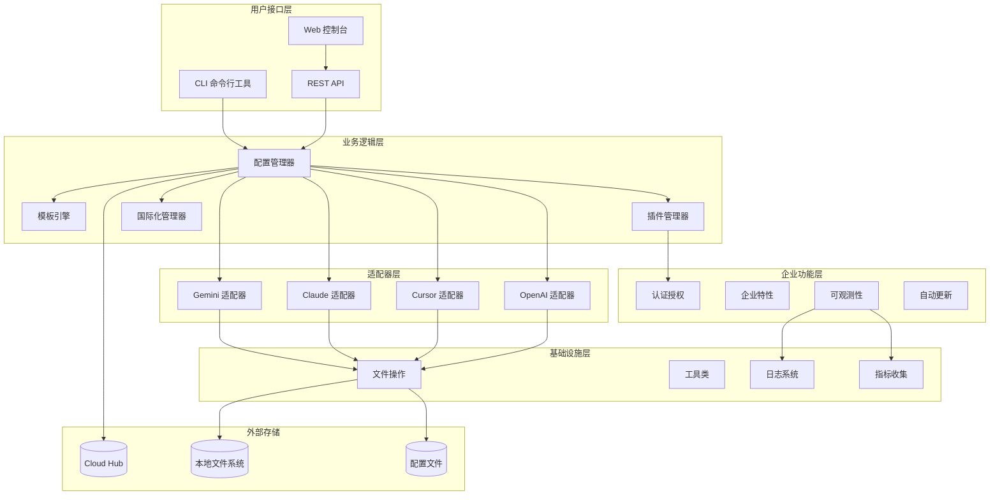
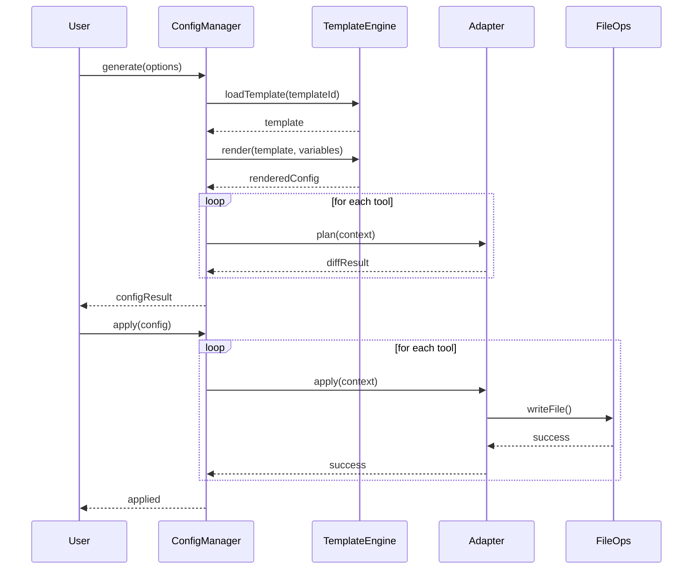
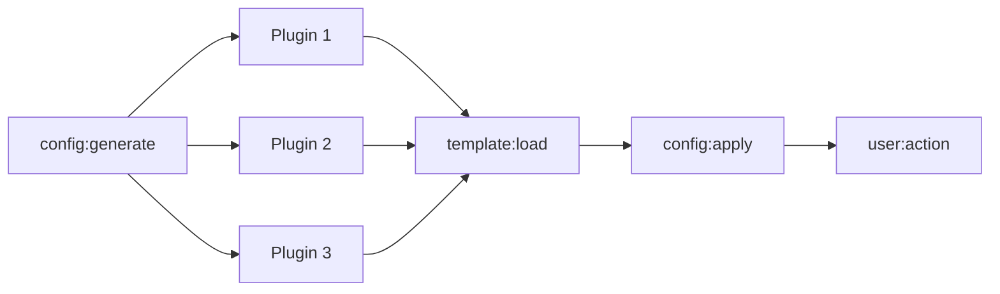
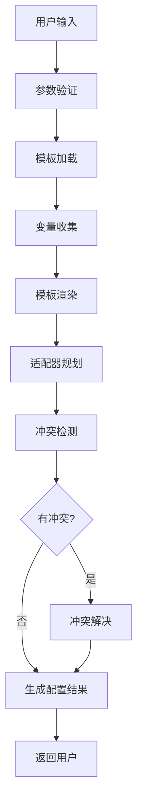
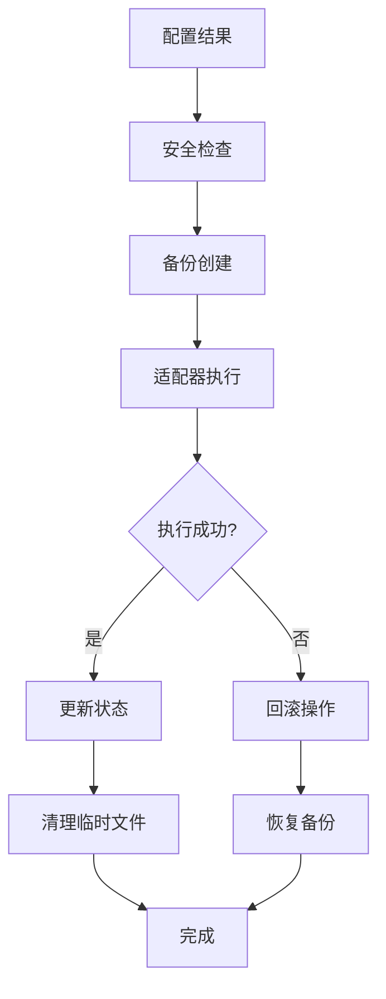
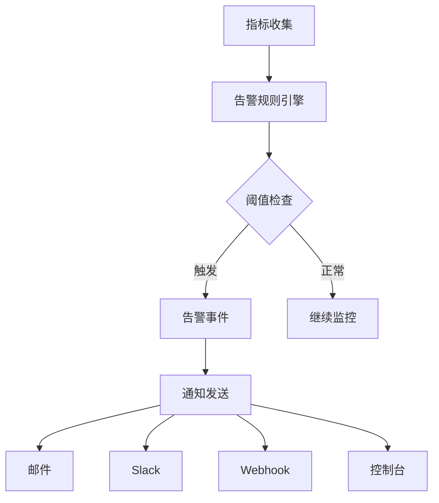
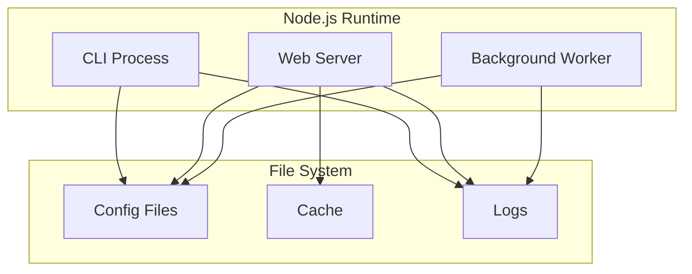
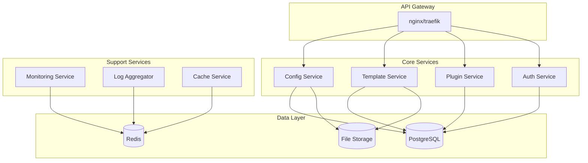

# meteor-shower 架构设计文档

## 概述

meteor-shower 是一个基于 Node.js 和 TypeScript 的 AI 编程工具一键优化与同步平台。本文档详细介绍了系统的整体架构、核心组件设计、数据流处理和关键技术决策。

## 目录

1. [系统架构概览](#系统架构概览)
2. [核心模块设计](#核心模块设计)
3. [数据流架构](#数据流架构)
4. [插件系统架构](#插件系统架构)
5. [监控和可观测性](#监控和可观测性)
6. [安全架构](#安全架构)
7. [部署架构](#部署架构)
8. [技术栈选择](#技术栈选择)

## 系统架构概览

### 整体架构图



### 架构特点

1. **分层架构**：清晰的层次结构，便于维护和扩展
2. **松耦合设计**：各模块间通过接口交互，降低依赖
3. **插件化架构**：支持功能扩展和自定义
4. **微服务友好**：可拆分为独立的微服务
5. **多端支持**：CLI、Web UI、API 多种访问方式

## 核心模块设计

### 1. CLI 模块 (`packages/cli`)

**职责：**
- 提供命令行交互界面
- 处理用户输入和参数解析
- 调用核心业务逻辑

**主要组件：**

```typescript
// 命令接口定义
interface Command {
  name: string;
  description: string;
  options: CommandOption[];
  handler: (args: CommandArgs) => Promise<void>;
}

// 命令注册器
class CommandRegistry {
  private commands: Map<string, Command> = new Map();
  
  register(command: Command): void;
  execute(commandName: string, args: CommandArgs): Promise<void>;
}
```

**设计模式：**
- **命令模式**：每个 CLI 命令都是一个独立的命令对象
- **工厂模式**：通过工厂创建不同类型的命令

### 2. 配置管理器 (`packages/utils/config-generator`)

**职责：**
- 统一管理配置生成和应用
- 协调各个适配器的工作
- 处理配置验证和冲突解决

**核心接口：**

```typescript
interface ConfigManager {
  generate(options: GenerateOptions): Promise<ConfigResult>;
  apply(config: ConfigResult, context: ApplyContext): Promise<void>;
  validate(config: ConfigResult): ValidationResult;
  rollback(context: ApplyContext): Promise<void>;
}

interface GenerateOptions {
  tools: string[];
  template: string;
  variables: Record<string, unknown>;
  outputPath?: string;
}
```

**工作流程：**



### 3. 模板引擎 (`packages/utils/template-engine`)

**职责：**
- 模板加载和验证
- 变量替换和渲染
- 模板缓存管理

**架构设计：**

```typescript
class TemplateEngine {
  private cache: Map<string, TemplateMetadata> = new Map();
  private validator: TemplateValidator;
  
  async loadTemplate(templateId: string): Promise<TemplateMetadata>;
  async renderTemplate(template: TemplateMetadata, variables: Record<string, unknown>): Promise<string>;
  validateTemplate(template: TemplateMetadata): ValidationResult;
}

interface TemplateMetadata {
  id: string;
  name: string;
  version: string;
  targets: string[];
  variables: Record<string, string>;
  schema?: JSONSchema;
}
```

**模板系统特性：**

1. **JSON Schema 验证**：确保模板格式正确
2. **变量插值**：支持 `{{variable}}` 语法
3. **条件渲染**：支持基于变量的条件逻辑
4. **模板继承**：支持模板之间的继承关系
5. **缓存机制**：提高模板加载性能

### 4. 适配器系统 (`packages/adapters`)

**设计模式：适配器模式**

```typescript
interface Adapter {
  plan(ctx: ApplyContext): Promise<DiffResult>;
  apply(ctx: ApplyContext): Promise<void>;
  rollback(ctx: ApplyContext): Promise<void>;
}

// 适配器基类
abstract class BaseAdapter implements Adapter {
  protected fileOps: FileOperations;
  protected backupPaths: Map<string, string> = new Map();
  
  abstract getConfigPaths(): string[];
  abstract generateConfig(variables: Record<string, unknown>): Promise<ConfigFiles>;
}

// 具体适配器实现
class GeminiAdapter extends BaseAdapter {
  getConfigPaths(): string[] {
    return ['~/.gemini/GEMINI.md', '~/.gemini/settings.json'];
  }
  
  async generateConfig(variables: Record<string, unknown>): Promise<ConfigFiles> {
    // Gemini 特定的配置生成逻辑
  }
}
```

**适配器特性：**

1. **统一接口**：所有适配器实现相同的接口
2. **独立性**：每个适配器独立处理特定工具的配置
3. **可扩展性**：易于添加新的工具适配器
4. **错误隔离**：单个适配器的错误不影响其他适配器

### 5. 插件系统 (`packages/plugins`)

**架构设计：**

```typescript
interface Plugin {
  id: string;
  name: string;
  version: string;
  hooks: PluginHook[];
  dependencies: string[];
  enabled: boolean;
}

interface PluginHook {
  name: string;
  handler: (context: PluginContext) => Promise<any>;
}

class PluginManager {
  private plugins: Map<string, Plugin> = new Map();
  private hooks: Map<string, PluginHook[]> = new Map();
  
  async loadPlugin(pluginPath: string): Promise<Plugin>;
  async executeHook(hookName: string, context: PluginContext): Promise<any>;
}
```

**钩子系统：**



**插件生命周期：**

1. **加载阶段**：加载插件文件，验证格式
2. **注册阶段**：注册钩子，解决依赖关系
3. **执行阶段**：在对应的生命周期点执行钩子
4. **卸载阶段**：清理资源，移除钩子

## 数据流架构

### 配置生成数据流



### 配置应用数据流



### 数据持久化

**配置数据：**
- 用户配置：`~/.meteor-shower/config.json`
- 缓存数据：`~/.meteor-shower/cache/`
- 备份数据：`~/.meteor-shower/backups/`

**云端数据：**
- 模板库：Cloud Hub 存储
- 用户数据：加密存储
- 分析数据：匿名化处理

## 插件系统架构

### 插件加载机制

```typescript
class PluginLoader {
  async loadFromDirectory(directory: string): Promise<Plugin[]> {
    const files = await fs.readdir(directory);
    const plugins: Plugin[] = [];
    
    for (const file of files) {
      if (file.endsWith('.js') || file.endsWith('.ts')) {
        try {
          const plugin = await import(path.join(directory, file));
          plugins.push(plugin.default || plugin);
        } catch (error) {
          console.warn(`Failed to load plugin ${file}:`, error);
        }
      }
    }
    
    return plugins;
  }
}
```

### 插件隔离

1. **进程隔离**：插件在独立的子进程中运行
2. **权限控制**：限制插件的文件系统访问权限
3. **资源限制**：限制插件的 CPU 和内存使用
4. **超时控制**：防止插件执行时间过长

### 插件通信

```typescript
interface PluginMessage {
  type: 'request' | 'response' | 'event';
  id: string;
  data: any;
}

class PluginIPC {
  send(pluginId: string, message: PluginMessage): Promise<any>;
  receive(callback: (message: PluginMessage) => void): void;
}
```

## 监控和可观测性

### 指标收集架构

```typescript
class MetricsCollector {
  private metrics: Metric[] = [];
  private collectors: Map<string, MetricCollector> = new Map();
  
  recordMetric(name: string, value: number, tags?: Record<string, string>): void;
  getMetrics(query: MetricQuery): Metric[];
  exportMetrics(format: 'json' | 'prometheus'): string;
}
```

### 日志系统

```typescript
interface LogEntry {
  timestamp: Date;
  level: 'debug' | 'info' | 'warn' | 'error';
  message: string;
  context: Record<string, any>;
  source: string;
}

class Logger {
  private transports: LogTransport[] = [];
  
  log(level: LogLevel, message: string, context?: Record<string, any>): void;
  addTransport(transport: LogTransport): void;
}
```

### 告警系统架构



## 安全架构

### 认证和授权

```typescript
interface User {
  id: string;
  name: string;
  email: string;
  role: 'admin' | 'user' | 'viewer';
  permissions: string[];
}

class AuthManager {
  async authenticate(token: string): Promise<User | null>;
  async checkPermission(user: User, action: string, resource?: string): Promise<boolean>;
}
```

### 安全措施

1. **输入验证**：所有用户输入都经过严格验证
2. **路径遍历防护**：防止 `../` 等路径遍历攻击
3. **命令注入防护**：过滤危险命令和字符
4. **权限最小化**：只给予必要的最小权限
5. **敏感信息加密**：API 密钥等敏感信息加密存储

### 安全配置

```json
{
  "security": {
    "dangerousCommands": ["rm -rf", "sudo", "dd"],
    "allowedPaths": ["~/.meteor-shower", "./"],
    "encryptSecrets": true,
    "requireConfirmation": true,
    "auditLog": true
  }
}
```

## 部署架构

### 单机部署



### 容器化部署

```dockerfile
# Dockerfile 架构
FROM node:18-alpine

# 应用层
COPY packages/ /app/packages/
COPY scripts/ /app/scripts/

# 依赖层
COPY package*.json /app/
RUN npm ci --only=production

# 运行时
EXPOSE 3000 3001 3002
CMD ["npm", "start"]
```

### Kubernetes 部署

```yaml
# k8s 部署架构
apiVersion: apps/v1
kind: Deployment
metadata:
  name: meteor-shower
spec:
  replicas: 3
  selector:
    matchLabels:
      app: meteor-shower
  template:
    spec:
      containers:
      - name: meteor-shower
        image: meteor-shower:latest
        ports:
        - containerPort: 3000
        - containerPort: 3001
        env:
        - name: NODE_ENV
          value: "production"
```

### 微服务架构



## 技术栈选择

### 后端技术栈

| 技术 | 选择理由 | 版本 |
|------|----------|------|
| **Node.js** | 跨平台支持，丰富的生态系统 | 18+ |
| **TypeScript** | 类型安全，更好的开发体验 | 5.0+ |
| **Express.js** | 轻量级 Web 框架，易于扩展 | 4.18+ |

### 前端技术栈

| 技术 | 选择理由 | 版本 |
|------|----------|------|
| **HTML/CSS/JS** | 简单直接，无需复杂构建 | ES2022 |
| **Chart.js** | 轻量级图表库，功能丰富 | 4.0+ |

### 工具和框架

| 类别 | 技术选择 | 选择理由 |
|------|----------|----------|
| **测试框架** | Vitest | 快速，现代化的测试框架 |
| **代码质量** | ESLint + Prettier | 统一代码风格 |
| **构建工具** | TypeScript Compiler | 原生 TS 支持 |
| **包管理** | npm workspaces | 单仓库管理多包 |
| **容器化** | Docker | 标准化部署 |
| **编排** | Kubernetes | 生产级容器编排 |

### 设计模式应用

1. **适配器模式**：工具适配器统一接口
2. **观察者模式**：插件钩子系统
3. **工厂模式**：配置生成器创建
4. **策略模式**：不同的配置应用策略
5. **命令模式**：CLI 命令系统
6. **单例模式**：全局配置管理器

### 架构优势

1. **可扩展性**：插件系统支持功能扩展
2. **可维护性**：清晰的模块分离和接口定义
3. **可测试性**：依赖注入和接口抽象
4. **可部署性**：支持多种部署方式
5. **可观测性**：完整的监控和日志系统

---

本架构文档详细描述了 meteor-shower 的系统设计，为开发、维护和扩展提供了指导。随着项目的发展，本文档也会持续更新和完善。