# CI/CD 学习指南

## 📚 目录
- [CI/CD 基础概念](#cicd-基础概念)
- [GitHub Actions 详解](#github-actions-详解)
- [Docker 在 CI/CD 中的作用](#docker-在-cicd-中的作用)
- [项目 CI/CD 配置解析](#项目-cicd-配置解析)
- [问题排查与修复过程](#问题排查与修复过程)
- [最佳实践与经验总结](#最佳实践与经验总结)

---

## CI/CD 基础概念

### 🤔 什么是 CI/CD？

**CI (Continuous Integration) - 持续集成**
- **定义**：频繁地将代码变更集成到主分支，通过自动化构建和测试来快速发现错误
- **目标**：确保代码质量，减少集成问题
- **频率**：每次代码提交都会触发

**CD (Continuous Deployment/Delivery) - 持续部署/交付**
- **持续交付**：代码通过所有测试后，自动部署到测试环境
- **持续部署**：代码通过所有测试后，自动部署到生产环境
- **目标**：快速、安全地发布软件

### 🔄 CI/CD 工作流程

```mermaid
graph LR
    A[开发者提交代码] --> B[CI 触发]
    B --> C[代码检查]
    C --> D[运行测试]
    D --> E[构建应用]
    E --> F[构建 Docker 镜像]
    F --> G[安全扫描]
    G --> H[部署到测试环境]
    H --> I[部署到生产环境]
```



### 🎯 CI/CD 的核心价值

1. **自动化**：减少人工操作，提高效率
2. **一致性**：确保每次部署的环境和流程一致
3. **快速反馈**：问题能快速发现和修复
4. **质量保证**：通过自动化测试确保代码质量
5. **风险降低**：小步快跑，降低发布风险

---

## GitHub Actions 详解

### 🏗️ GitHub Actions 架构

GitHub Actions 是 GitHub 提供的 CI/CD 平台，核心概念：

**Workflow（工作流）**
- 定义在 `.github/workflows/` 目录下的 YAML 文件
- 包含一个或多个 Job（作业）

**Job（作业）**
- 在同一个运行器上执行的一组 Step（步骤）
- 可以并行或串行执行

**Step（步骤）**
- 单个任务，可以是命令或 Action
- 按顺序执行

**Runner（运行器）**
- 执行 Workflow 的服务器
- GitHub 提供托管运行器，也可以使用自托管

### 📝 我们的 CI/CD 配置解析

```yaml
# .github/workflows/ci.yml
name: CI/CD Pipeline

on:
  push:
    branches: [ main, develop ]  # 触发条件：推送到 main 或 develop 分支
  pull_request:
    branches: [ main ]           # 触发条件：创建 PR 到 main 分支

jobs:
  test:                          # 测试作业
    runs-on: ubuntu-latest       # 使用 GitHub 托管的 Ubuntu 运行器
    
    steps:
    - uses: actions/checkout@v4  # 检出代码
    - name: Setup Node.js
      uses: actions/setup-node@v4
      with:
        node-version: '18'       # 设置 Node.js 版本
        cache: 'npm'             # 缓存 npm 依赖
    
    - name: Install dependencies
      run: npm ci                # 安装依赖
    
    - name: Run tests
      run: npm test              # 运行测试
    
    - name: Build project
      run: npm run build         # 构建项目

  build:                         # 构建作业
    needs: test                  # 依赖 test 作业完成
    runs-on: ubuntu-latest
    
    steps:
    - uses: actions/checkout@v4
    - name: Build Docker image
      run: docker build -t meteor-shower:${{ github.sha }} .  # 构建 Docker 镜像
    
    - name: Run security scan
      run: docker run --rm -v /var/run/docker.sock:/var/run/docker.sock aquasec/trivy image meteor-shower:${{ github.sha }}

  deploy:                        # 部署作业
    needs: build                 # 依赖 build 作业完成
    runs-on: ubuntu-latest
    if: github.ref == 'refs/heads/main'  # 只在 main 分支执行
    
    steps:
    - uses: actions/checkout@v4
    - name: Deploy to staging
      run: echo "Deploying to staging environment"
    - name: Deploy to production
      run: echo "Deploying to production environment"
```

### 🔍 关键配置说明

**触发条件 (on)**
- `push`: 代码推送时触发
- `pull_request`: 创建 PR 时触发
- `schedule`: 定时触发
- `workflow_dispatch`: 手动触发

**作业依赖 (needs)**
- 确保作业按顺序执行
- `test` → `build` → `deploy`

**条件执行 (if)**
- 只在特定条件下执行
- 例如：只在 main 分支部署

---

## Docker 在 CI/CD 中的作用

### 🐳 为什么使用 Docker？

**1. 环境一致性**
```bash
# 开发环境
npm install
npm run build

# 生产环境（Docker 容器内）
npm install
npm run build
```
确保开发和生产环境完全一致。

**2. 依赖隔离**
- 每个应用运行在独立的容器中
- 避免依赖冲突
- 便于管理和维护

**3. 可移植性**
- 一次构建，到处运行
- 支持多云部署
- 简化部署流程

### 🏗️ Docker 构建过程

**1. 基础镜像选择**
```dockerfile
FROM node:18-alpine  # 使用 Node.js 18 Alpine 版本
```
- Alpine：轻量级 Linux 发行版
- 镜像大小小，安全性高

**2. 工作目录设置**
```dockerfile
WORKDIR /app  # 设置工作目录
```

**3. 依赖安装**
```dockerfile
COPY package*.json ./
RUN npm install
```

**4. 代码复制和构建**
```dockerfile
COPY . .
RUN npm run build
```

**5. 生产优化**
```dockerfile
RUN npm prune --production  # 删除开发依赖
```

---

## 项目 CI/CD 配置解析

### 📁 项目结构

```
meteor-shower/
├── .github/
│   └── workflows/
│       └── ci.yml              # CI/CD 配置文件
├── packages/                   # Monorepo 包
│   ├── cli/                    # CLI 工具
│   ├── cloud-hub/              # 云服务
│   ├── ui/                     # UI 控制台
│   └── ...
├── Dockerfile                  # Docker 构建文件
├── .dockerignore              # Docker 忽略文件
└── scripts/
    └── docker-entrypoint.sh   # Docker 启动脚本
```

### 🔄 完整流程解析

**1. 代码提交触发**
```bash
git push origin main
```

**2. GitHub Actions 启动**
- 检出代码到运行器
- 设置 Node.js 环境
- 安装依赖

**3. 测试阶段**
```bash
npm test          # 运行单元测试
npm run lint      # 代码检查
npm run build     # 构建项目
```

**4. 构建阶段**
```bash
docker build -t meteor-shower:$GITHUB_SHA .
```

**5. 安全扫描**
```bash
trivy image meteor-shower:$GITHUB_SHA
```

**6. 部署阶段**
- 部署到测试环境
- 运行冒烟测试
- 部署到生产环境

---

## 问题排查与修复过程

### 🐛 问题 1：缺少依赖锁定文件

**错误信息：**
```
Error: Dependencies lock file is not found in /home/runner/work/meteor-shower/meteor-shower. 
Supported file patterns: package-lock.json,npm-shrinkwrap.json,yarn.lock
```

**原因分析：**
- CI 环境需要依赖锁定文件确保版本一致性
- 项目缺少 `package-lock.json` 文件

**解决方案：**
```bash
# 生成依赖锁定文件
npm install
```

**学习要点：**
- `package-lock.json` 记录确切的依赖版本
- 确保开发和生产环境使用相同版本
- CI 环境优先使用 `npm ci` 而不是 `npm install`

### 🐛 问题 2：TypeScript 编译错误

**错误信息：**
```
src/commands/init.ts:1:22 - error TS7016: Could not find a declaration file for module 'inquirer'
```

**原因分析：**
- 缺少类型定义文件
- 导入路径错误

**解决方案：**
```bash
# 安装类型定义
npm install --save-dev @types/inquirer

# 修复导入路径
import { ConfigGenerator } from '../../utils/src/config-generator.js';
```

**学习要点：**
- TypeScript 需要类型定义文件
- 使用 `@types/` 包提供类型定义
- 注意模块导入路径的正确性

### 🐛 问题 3：Docker 构建失败

**错误信息：**
```
npm error Missing: meteor-shower-utils@0.1.0 from lock file
```

**原因分析：**
- `npm ci` 在 monorepo 中无法正确处理 workspace 依赖
- Docker 环境中的依赖解析问题

**解决方案：**
```dockerfile
# 使用 npm install 替代 npm ci
RUN npm install && npm run build
RUN npm prune --production
```

**学习要点：**
- `npm ci` 要求 package.json 和 package-lock.json 完全同步
- Monorepo 在 Docker 中需要特殊处理
- 多阶段构建可以优化镜像大小

### 🐛 问题 4：健康检查失败

**错误信息：**
```
HEALTHCHECK failed: curl: command not found
```

**原因分析：**
- Alpine Linux 默认没有 curl 命令
- 健康检查命令不正确

**解决方案：**
```dockerfile
# 使用 wget 替代 curl
HEALTHCHECK --interval=30s --timeout=3s --start-period=5s --retries=3 \
  CMD wget --no-verbose --tries=1 --spider http://localhost:3000/health || exit 1
```

**学习要点：**
- 不同基础镜像包含不同的工具
- 健康检查是容器监控的重要手段
- 选择合适的工具进行健康检查

---

## 最佳实践与经验总结

### ✅ CI/CD 最佳实践

**1. 快速反馈**
- 保持构建时间短（< 10 分钟）
- 并行执行独立的任务
- 优先运行快速测试

**2. 失败快速**
- 遇到错误立即停止
- 提供清晰的错误信息
- 支持快速重试

**3. 环境一致性**
- 使用 Docker 容器化
- 锁定依赖版本
- 统一构建环境

**4. 安全性**
- 定期更新依赖
- 进行安全扫描
- 使用最小权限原则

### 🎯 项目特定经验

**1. Monorepo 处理**
```yaml
# 使用 workspace 管理多包
- name: Install dependencies
  run: npm ci
- name: Build all packages
  run: npm run build --workspaces
```

**2. Docker 优化**
```dockerfile
# 多阶段构建减小镜像大小
FROM node:18-alpine AS builder
# ... 构建阶段

FROM node:18-alpine AS production
# ... 生产阶段
```

**3. 错误处理**
```yaml
# 允许测试失败但继续构建
- name: Run tests
  run: npm test || echo "Tests failed but continuing"
```

### 📊 监控与维护

**1. 构建状态监控**
- 设置构建状态徽章
- 配置通知机制
- 定期检查构建历史

**2. 性能优化**
- 使用缓存加速构建
- 并行执行独立任务
- 定期清理无用资源

**3. 文档维护**
- 记录部署流程
- 更新故障排除指南
- 保持配置文档同步

---

## 🚀 下一步学习建议

### 1. 深入学习
- **Docker 高级特性**：多阶段构建、Docker Compose
- **Kubernetes**：容器编排和管理
- **监控和日志**：Prometheus、Grafana、ELK Stack

### 2. 实践项目
- 为其他项目配置 CI/CD
- 尝试不同的部署策略
- 实现蓝绿部署、金丝雀发布

### 3. 工具探索
- **GitLab CI/CD**：GitLab 的 CI/CD 平台
- **Jenkins**：开源自动化服务器
- **ArgoCD**：GitOps 持续交付工具

### 4. 安全实践
- **Secrets 管理**：GitHub Secrets、HashiCorp Vault
- **安全扫描**：SAST、DAST、依赖扫描
- **合规性**：SOC 2、ISO 27001

---

## 📚 参考资源

- [GitHub Actions 官方文档](https://docs.github.com/en/actions)
- [Docker 官方文档](https://docs.docker.com/)
- [CI/CD 最佳实践](https://martinfowler.com/articles/continuousIntegration.html)
- [12-Factor App](https://12factor.net/)

---

*本文档基于 meteor-shower 项目的实际 CI/CD 配置和问题修复过程编写，适合后端开发人员学习 CI/CD 基础知识。*