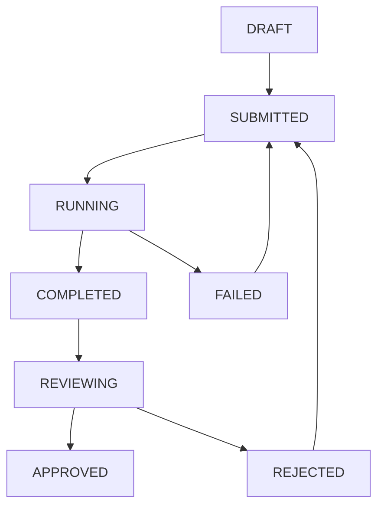

# 任务协调管理模块设计文档

## 📋 概述

### 背景与痛点
在与AI编程工具协作中，存在明显的异步性和管理挑战：

**现实场景：**
- **编写阶段**：人类花费1-几分钟编写需求
- **执行阶段**：AI工具需要几分钟到几十分钟执行
- **检查阶段**：人类检查结果，决定下一步

**核心痛点：**
1. **多任务并行困难**：启动A、B、C、D任务，当D发出时A可能已完成
2. **状态跟踪分散**：不同工具提醒机制不统一
3. **上下文切换成本高**：频繁在工具间切换
4. **工作碎片化**：缺乏统一的优先级管理

### 解决方案
作为外挂协调层，提供：
- 统一任务管理
- 智能调度
- 聚合通知
- 工作流优化

## 🎯 核心功能

### 1. 任务生命周期管理

#### 任务状态模型
```typescript
enum TaskStatus {
  DRAFT = 'draft',           // 草稿
  SUBMITTED = 'submitted',   // 已提交
  RUNNING = 'running',       // 执行中
  COMPLETED = 'completed',   // 已完成
  REVIEWING = 'reviewing',   // 检查中
  APPROVED = 'approved',     // 已通过
  REJECTED = 'rejected',     // 已拒绝
  CANCELLED = 'cancelled',   // 已取消
  FAILED = 'failed'          // 执行失败
}

interface Task {
  id: string;
  title: string;
  description: string;
  tool: 'gemini' | 'claude' | 'cursor' | 'openai';
  prompt: string;
  status: TaskStatus;
  priority: 'low' | 'medium' | 'high' | 'urgent';
  dependencies?: string[];
  createdAt: Date;
  estimatedDuration?: number;
  actualDuration?: number;
  output?: any;
  rating?: number;
}
```

#### 状态流转图


### 2. 跨工具任务监控

#### 工具适配器接口
```typescript
interface ToolAdapter {
  submitTask(task: Task): Promise<string>;
  getTaskStatus(toolTaskId: string): Promise<TaskStatusInfo>;
  cancelTask(toolTaskId: string): Promise<boolean>;
  getTaskResult(toolTaskId: string): Promise<TaskResult>;
}

class TaskMonitor {
  private adapters: Map<string, ToolAdapter> = new Map();
  private activeTasks: Map<string, MonitoredTask> = new Map();
  
  async startMonitoring(task: Task): Promise<void> {
    const adapter = this.adapters.get(task.tool);
    const toolTaskId = await adapter.submitTask(task);
    
    this.activeTasks.set(task.id, { task, toolTaskId, adapter });
    this.schedulePolling(task.id);
  }
  
  private async pollTaskStatus(taskId: string): Promise<void> {
    // 轮询工具状态，更新任务状态，发送通知
  }
}
```

### 3. 智能调度与提醒

#### 调度策略
```typescript
class TaskScheduler {
  calculatePriorityScore(task: Task, context: ScheduleContext): number {
    let score = 0;
    
    // 基础优先级权重
    const priorityWeight = { urgent: 100, high: 75, medium: 50, low: 25 };
    score += priorityWeight[task.priority];
    
    // 依赖关系权重
    score += (task.blocks?.length || 0) * 10;
    
    // 等待时间权重
    const waitHours = (Date.now() - task.createdAt.getTime()) / (1000 * 60 * 60);
    score += Math.min(waitHours * 2, 20);
    
    return score;
  }
  
  selectNextTask(pendingTasks: Task[], context: ScheduleContext): Task | null {
    const readyTasks = pendingTasks.filter(task => 
      this.areDependenciesSatisfied(task)
    );
    
    const scoredTasks = readyTasks.map(task => ({
      task,
      score: this.calculatePriorityScore(task, context)
    }));
    
    scoredTasks.sort((a, b) => b.score - a.score);
    return scoredTasks[0]?.task || null;
  }
}
```

#### 通知系统
```typescript
enum NotificationType {
  TASK_COMPLETED = 'task_completed',
  TASK_FAILED = 'task_failed',
  REVIEW_NEEDED = 'review_needed',
  SCHEDULE_SUGGESTION = 'schedule_suggestion'
}

class NotificationService {
  async notifyTaskCompletion(task: Task): Promise<void> {
    const notification = {
      type: NotificationType.TASK_COMPLETED,
      title: '任务已完成',
      message: `任务"${task.title}"已完成，请检查结果`,
      actions: [
        { label: '立即检查', action: `review_task:${task.id}` },
        { label: '稍后处理', action: `dismiss:${task.id}` }
      ]
    };
    
    await this.sendNotification(notification);
  }
}
```

### 4. 工作流管理

#### 工作流定义
```typescript
interface Workflow {
  id: string;
  name: string;
  steps: WorkflowStep[];
  variables?: Record<string, any>;
}

interface WorkflowStep {
  id: string;
  name: string;
  type: 'task' | 'condition' | 'wait' | 'script';
  config: any;
  dependsOn?: string[];
}

// 预定义工作流示例
const codeReviewWorkflow: Workflow = {
  id: 'code-review-workflow',
  name: '代码审查工作流',
  steps: [
    {
      id: 'security-check',
      name: '安全检查',
      type: 'task',
      config: { tool: 'claude', prompt: '检查代码安全漏洞...' }
    },
    {
      id: 'quality-analysis',
      name: '质量分析',
      type: 'task',
      config: { tool: 'gemini', prompt: '分析代码质量...' }
    },
    {
      id: 'optimization',
      name: '优化建议',
      type: 'task',
      config: { tool: 'cursor', prompt: '提供优化建议...' },
      dependsOn: ['security-check', 'quality-analysis']
    }
  ]
};
```

### 5. 统一任务仪表板

#### 仪表板状态
```typescript
interface DashboardState {
  taskStats: {
    total: number;
    byStatus: Record<TaskStatus, number>;
    byTool: Record<string, number>;
  };
  currentActivity: {
    runningTasks: Task[];
    completedTasks: Task[];
    pendingReviews: Task[];
    suggestions: ScheduleSuggestion[];
  };
  performance: {
    avgTaskDuration: number;
    completionRate: number;
    toolEfficiency: Record<string, number>;
  };
}
```

## 🏗️ 技术架构

### 系统架构
```
用户界面层: CLI命令 + Web界面 + 桌面通知
业务逻辑层: TaskCoordinator + Scheduler + Monitor + NotificationService
适配器层: Gemini + Claude + Cursor + OpenAI适配器
数据存储层: SQLite/PostgreSQL + 文件系统
```

### 核心类设计
```typescript
class TaskCoordinator {
  // 核心调度器
  async submitTask(task: Task): Promise<string>;
  async getScheduleSuggestions(): Promise<ScheduleSuggestion[]>;
  async startWorkflow(workflowId: string): Promise<string>;
}

class TaskManager {
  // 任务CRUD操作
  async createTask(task: Partial<Task>): Promise<Task>;
  async updateTask(taskId: string, updates: Partial<Task>): Promise<Task>;
  async getTasks(filter?: TaskFilter): Promise<Task[]>;
}
```

### 数据模型
```sql
-- 任务表
CREATE TABLE tasks (
    id VARCHAR(50) PRIMARY KEY,
    title VARCHAR(200) NOT NULL,
    tool VARCHAR(50) NOT NULL,
    prompt TEXT NOT NULL,
    status VARCHAR(20) NOT NULL,
    priority VARCHAR(20) NOT NULL,
    dependencies JSON,
    created_at TIMESTAMP DEFAULT CURRENT_TIMESTAMP,
    completed_at TIMESTAMP,
    actual_duration INTEGER,
    rating INTEGER,
    output JSON
);

-- 工作流表  
CREATE TABLE workflows (
    id VARCHAR(50) PRIMARY KEY,
    name VARCHAR(200) NOT NULL,
    definition JSON NOT NULL,
    created_at TIMESTAMP DEFAULT CURRENT_TIMESTAMP
);

-- 通知表
CREATE TABLE notifications (
    id VARCHAR(50) PRIMARY KEY,
    type VARCHAR(50) NOT NULL,
    title VARCHAR(200) NOT NULL,
    message TEXT NOT NULL,
    task_id VARCHAR(50),
    created_at TIMESTAMP DEFAULT CURRENT_TIMESTAMP
);
```

## 📱 用户界面

### CLI 命令
```bash
# 任务管理
meteor-shower task create --title "优化登录" --tool gemini --priority high
meteor-shower task list --status running
meteor-shower task show <task-id>
meteor-shower task review <task-id> --rating 5

# 调度管理
meteor-shower schedule status
meteor-shower schedule suggestions
meteor-shower schedule start <task-id>

# 工作流管理
meteor-shower workflow start <workflow-id> --var prompt="优化性能"
meteor-shower workflow status <execution-id>

# 仪表板
meteor-shower dashboard
meteor-shower dashboard --refresh 30
```

### Web UI 结构
```
├── 仪表板 - 概览与实时状态
├── 任务管理 - 任务列表、详情、创建
├── 调度中心 - 调度队列、建议、配置
├── 工作流 - 工作流库、执行历史
├── 通知中心 - 通知列表、设置
└── 设置 - 工具配置、偏好设置
```

## 🚀 实施路线图

### 📋 总体时间安排
```
┌─────────────────────────────────────────────────────────────┐
│                    M8实施时间线 (6周)                       │
├─────────────────────────────────────────────────────────────┤
│  Week 1-2   │  Week 3-4   │  Week 5   │  Week 6    │  Week 7-8 │
├─────────────────────────────────────────────────────────────┤
│  Phase 1    │  Phase 2    │  Phase 3  │  Phase 4   │  集成测试 │
│  核心任务   │  智能调度  │  工作流  │  仪表板   │  &上线准备 │
│  管理       │  与监控    │ 与高级功能│ 与优化     │           │
└─────────────────────────────────────────────────────────────┘
```

### Phase 1: 核心任务管理 (2周)
**优先级**: 高 | **负责人**: 后端开发团队 | **预计时间**: 2周

#### 🎯 目标
建立任务管理的核心功能，实现任务的完整生命周期管理

#### 📋 具体任务清单
**Week 1 任务**:
- [ ] **任务数据模型设计**
  - 实现完整的 `Task` 接口和类型定义
  - 设计任务状态枚举 `TaskStatus`（9种状态）
  - 设计任务优先级枚举（低、中、高、紧急）
  - 设计任务依赖关系数据结构
  - 设计任务执行结果数据结构

- [ ] **TaskManager核心类**
  - 实现任务创建功能，支持所有字段验证
  - 实现任务查询功能，支持多条件筛选和分页
  - 实现任务更新功能，支持状态流转和字段修改
  - 实现任务删除功能，支持软删除和恢复
  - 实现任务统计和分析功能

- [ ] **状态流转引擎**
  - 实现状态验证和流转规则引擎
  - 实现状态变更历史记录
  - 实现状态变更通知机制
  - 实现非法状态变更防护
  - 实现状态恢复和回滚机制

- [ ] **基础CLI命令实现**
  - 实现 `meteor-shower task create` 命令
  - 实现 `meteor-shower task list` 命令
  - 实现 `meteor-shower task show` 命令
  - 实现 `meteor-shower task cancel` 命令
  - 实现 `meteor-shower task review` 命令

- [ ] **基础Web UI开发**
  - 实现任务列表页面，支持实时状态更新
  - 实现任务详情页面，展示完整任务信息
  - 实现任务创建表单，支持工具选择和参数配置
  - 实现任务状态筛选和搜索功能
  - 实现任务操作按钮（取消、重试、删除）

**Week 2 任务**:
- [ ] **工具适配器集成**
  - 集成Gemini工具适配器
  - 集成Claude工具适配器
  - 实现统一的工具接口抽象层
  - 实现工具任务提交和状态查询
  - 实现工具结果收集和格式转换

- [ ] **任务监控机制**
  - 实现任务执行进度跟踪
  - 实现任务超时检测和处理
  - 实现任务失败重试机制
  - 实现任务执行时间统计
  - 实现任务资源使用监控

- [ ] **基础通知系统**
  - 实现任务状态变更通知
  - 实现任务完成提醒通知
  - 实现任务失败告警通知
  - 实现通知渠道管理（控制台、邮件、推送）
  - 实现通知历史记录和查询

- [ ] **数据持久化**
  - 设计任务数据表结构和索引
  - 实现数据库迁移脚本
  - 实现数据备份和恢复机制
  - 实现数据清理和归档策略
  - 实现数据库连接池和性能优化

- [ ] **单元测试覆盖**
  - 为TaskManager编写完整单元测试
  - 为状态流转引擎编写测试用例
  - 为工具适配器编写集成测试
  - 为通知系统编写测试
  - 实现端到端工作流测试

#### 🏆 里程碑
- **Day 7**: 完成数据模型和TaskManager基础功能
- **Day 14**: 完成工具集成和单元测试

#### 🔗 依赖关系
- 依赖现有CLI框架和数据库模块
- 依赖现有AI工具适配器（packages/adapters）
- 需要WebSocket支持实时状态更新

#### ⚠️ 风险评估
- **技术风险**: 中等 - 需要处理复杂的任务状态流转逻辑
- **性能风险**: 中等 - 需要支持大量并发任务监控
- **扩展性风险**: 中等 - 需要支持未来新增的任务类型和工具
- **数据一致性风险**: 高 - 任务状态变更需要保证数据一致性

#### ✅ 成功标准
- [ ] 任务数据模型支持所有预定义状态和字段
- [ ] CRUD操作响应时间<200ms，支持高并发访问
- [ ] 状态流转逻辑正确可靠，无死锁或异常状态
- [ ] CLI命令功能完整，用户体验良好
- [ ] 工具适配器正确集成，支持主流AI工具
- [ ] 单元测试覆盖率达到90%以上

### Phase 2: 智能调度与监控 (2周)
**优先级**: 高 | **负责人**: 调度算法团队 | **预计时间**: 2周

#### 🎯 目标
实现智能调度算法和跨工具监控系统，提升任务执行效率

#### 📋 具体任务清单
**Week 3 任务**:
- [ ] **TaskScheduler智能调度**
  - 实现优先级权重计算算法
  - 实现依赖关系处理机制
  - 实现等待时间权重计算
  - 实现资源负载均衡算法
  - 实现调度策略配置和调整

- [ ] **调度队列管理**
  - 实现任务队列数据结构
  - 实现队列优先级排序机制
  - 实现队列容量管理和扩缩容
  - 实现队列持久化和恢复机制
  - 实现队列监控和性能指标收集

- [ ] **跨工具监控系统**
  - 实现TaskMonitor监控核心类
  - 实现多工具状态收集机制
  - 实现监控数据聚合和分析
  - 实现监控告警规则引擎
  - 实现监控历史数据存储和查询

**Week 4 任务**:
- [ ] **NotificationService通知系统**
  - 实现多渠道通知支持（控制台、邮件、推送、桌面通知）
  - 实现通知模板和个性化配置
  - 实现通知聚合和去重机制
  - 实现通知优先级和紧急程度处理
  - 实现通知历史和统计分析

- [ ] **高级工具适配器**
  - 集成Cursor工具适配器
  - 集成OpenAI工具适配器
  - 实现适配器健康检查机制
  - 实现适配器故障转移机制
  - 实现适配器性能监控和优化

- [ ] **调度中心Web UI**
  - 实现调度队列可视化界面
  - 实现调度策略配置界面
  - 实现任务优先级调整界面
  - 实现调度性能监控仪表板
  - 实现调度历史和趋势分析

#### 🏆 里程碑
- **Day 21**: 完成智能调度算法和监控系统
- **Day 28**: 完成通知服务和调度中心UI

#### 🔗 依赖关系
- 依赖Phase 1的任务数据模型和TaskManager
- 依赖现有AI工具适配器扩展
- 需要WebSocket支持实时监控数据推送
- 需要通知服务支持（可与observability模块集成）

#### ⚠️ 风险评估
- **调度算法复杂度风险**: 高 - 需要平衡多个调度目标和约束条件
- **监控实时性风险**: 中等 - 需要及时收集各工具状态变化
- **通知及时性风险**: 中等 - 通知延迟会影响用户体验
- **扩展性风险**: 中等 - 需要支持更多AI工具的集成

#### ✅ 成功标准
- [ ] 调度算法合理分配任务优先级和资源
- [ ] 监控系统实时反映任务和工具状态
- [ ] 通知及时准确送达，聚合机制有效
- [ ] 新工具适配器快速集成，故障转移可靠
- [ ] 调度中心界面直观易用，提供有用洞察

### Phase 3: 工作流与高级功能 (1周)
**优先级**: 中 | **负责人**: 工作流开发团队 | **预计时间**: 1周

#### 🎯 目标
实现工作流引擎和高级任务管理功能，支持复杂业务场景

#### 📋 具体任务清单
**Week 5 任务**:
- [ ] **WorkflowEngine工作流引擎**
  - 实现工作流定义解析和验证
  - 实现工作流步骤依赖关系处理
  - 实现条件分支和循环控制逻辑
  - 实现工作流变量和参数传递
  - 实现工作流错误处理和回滚机制

- [ ] **预定义工作流模板**
  - 创建代码审查工作流模板
  - 创建文档生成工作流模板
  - 创建测试执行工作流模板
  - 创建多工具协作工作流模板
  - 实现工作流模板管理和版本控制

- [ ] **工作流管理界面**
  - 实现工作流模板选择和配置界面
  - 实现工作流执行监控和进度展示
  - 实现工作流编辑和定制界面
  - 实现工作流执行历史和日志查看
  - 实现工作流性能分析和优化建议

- [ ] **批量任务处理**
  - 实现批量任务创建和管理功能
  - 实现批量任务执行和进度跟踪
  - 实现批量任务结果汇总和分析
  - 实现批量任务失败处理和重试
  - 实现批量任务优先级和依赖管理

- [ ] **高级任务功能**
  - 实现任务标签和分类管理
  - 实现任务评论和协作功能
  - 实现任务收藏和书签功能
  - 实现任务搜索和高级筛选
  - 实现任务导入导出功能

#### 🏆 里程碑
- **Day 35**: 完成工作流引擎和高级功能开发

#### 🔗 依赖关系
- 依赖Phase 2的调度和监控系统
- 需要前端界面支持工作流可视化
- 需要模板引擎支持动态工作流生成

#### ⚠️ 风险评估
- **工作流复杂度风险**: 中等 - 需要处理复杂的工作流逻辑和依赖关系
- **模板定制性风险**: 中等 - 需要平衡易用性和灵活性
- **批量处理性能风险**: 中等 - 大量任务并发处理需要性能优化
- **用户体验风险**: 中等 - 工作流配置界面需要直观易用

#### ✅ 成功标准
- [ ] 工作流引擎正确执行预定义和自定义工作流
- [ ] 模板系统提供有用且易于定制的工作流模板
- [ ] 管理界面操作便捷，支持复杂工作流配置
- [ ] 批量处理功能高效稳定，支持大规模任务处理
- [ ] 高级功能提升用户体验，满足多样化需求

### Phase 4: 仪表板与优化 (1周)
**优先级**: 中 | **负责人**: 数据可视化团队 | **预计时间**: 1周

#### 🎯 目标
构建统一的任务仪表板，提供实时监控和深入的性能分析

#### 📋 具体任务清单
**Week 6 任务**:
- [ ] **DashboardManager统一仪表板**
  - 实现实时任务状态概览组件
  - 实现工具负载状态监控面板
  - 实现任务执行进度实时展示
  - 实现关键指标汇总和展示
  - 实现仪表板布局定制功能

- [ ] **实时数据可视化**
  - 实现任务状态分布饼图和趋势图
  - 实现工具使用率柱状图和热力图
  - 实现执行时间分布直方图
  - 实现错误率和成功率折线图
  - 实现性能指标实时更新机制

- [ ] **性能分析功能**
  - 实现任务执行效率分析工具
  - 实现工具性能对比分析报告
  - 实现瓶颈识别和优化建议
  - 实现历史趋势分析和预测
  - 实现自定义分析报表功能

- [ ] **用户配置和个性化**
  - 实现仪表板刷新频率配置
  - 实现关注的指标和图表选择
  - 实现布局和视图定制功能
  - 实现数据导出和分享功能
  - 实现通知偏好设置

- [ ] **高级监控功能**
  - 实现系统健康度监控面板
  - 实现资源使用情况监控
  - 实现异常检测和告警机制
  - 实现历史数据归档和清理
  - 实现监控数据统计和报告

#### 🏆 里程碑
- **Day 42**: 完成仪表板和分析功能开发

#### 🔗 依赖关系
- 依赖Phase 3的工作流引擎和监控数据
- 需要可视化库支持（Chart.js、D3.js）
- 需要WebSocket支持实时数据更新
- 需要数据导出库支持

#### ⚠️ 风险评估
- **性能风险**: 中等 - 实时数据更新和可视化需要性能优化
- **用户体验风险**: 中等 - 仪表板信息密度需要平衡可用性和美观性
- **数据准确性风险**: 高 - 分析结果直接影响决策，需要确保数据质量
- **扩展性风险**: 中等 - 需要支持更多类型的图表和分析维度

#### ✅ 成功标准
- [ ] 仪表板实时展示任务状态和系统健康度
- [ ] 数据可视化清晰直观，提供有用洞察
- [ ] 性能分析准确可靠，提供可操作的建议
- [ ] 用户配置灵活，支持个性化需求
- [ ] 高级监控功能及时发现和报告异常情况

### Phase 5: 集成测试与上线准备 (2周)
**优先级**: 高 | **负责人**: 测试与运维团队 | **预计时间**: 2周

#### 🎯 目标
确保系统稳定性和可靠性，为生产环境部署做好充分准备

#### 📋 具体任务清单
**Week 7 任务**:
- [ ] **集成测试**
  - 实现模块间接口和数据流测试
  - 实现完整工作流端到端测试
  - 实现多用户并发操作测试
  - 实现数据库迁移和数据一致性测试
  - 实现备份恢复功能测试

- [ ] **性能测试**
  - 实现大批量任务创建和调度性能测试
  - 实现高并发任务监控性能测试
  - 实现多工具并行执行性能测试
  - 实现数据库查询和写入性能测试
  - 实现前端界面响应性能测试

- [ ] **压力测试**
  - 实现大任务量场景压力测试
  - 实现长时间运行稳定性测试
  - 实现资源限制条件下的性能测试
  - 实现异常情况下的容错测试
  - 实现数据恢复和系统重启测试

**Week 8 任务**:
- [ ] **安全测试**
  - 实现任务数据访问控制测试
  - 实现敏感信息加密存储测试
  - 实现SQL注入和XSS防护测试
  - 实现权限绕过防护测试
  - 实现审计日志完整性测试

- [ ] **用户验收测试**
  - 准备UAT测试环境和测试数据
  - 编写详细的用户操作手册
  - 收集用户反馈和bug报告
  - 修复发现的问题和改进点
  - 确认用户验收标准全部达成

- [ ] **部署准备**
  - 编写自动化部署脚本和文档
  - 配置生产环境参数和监控
  - 设置日志收集和分析规则
  - 准备数据迁移和回滚方案
  - 制定应急预案和运维手册

#### 🏆 里程碑
- **Day 56**: 完成所有测试和部署准备工作

#### 🔗 依赖关系
- 依赖所有前序阶段的完整功能
- 需要测试框架和自动化工具支持
- 需要监控系统支持（可与observability模块集成）
- 需要CI/CD流水线支持

#### ⚠️ 风险评估
- **集成风险**: 中等 - 模块间接口和数据流需要充分验证
- **性能风险**: 中等 - 高负载场景需要严格的性能测试
- **安全风险**: 高 - 需要确保生产环境的安全性和稳定性
- **部署风险**: 中等 - 需要确保部署过程平稳和可回滚

#### ✅ 成功标准
- [ ] 集成测试通过率>95%，无严重缺陷或阻塞问题
- [ ] 性能测试满足预定义指标（响应时间<200ms，并发>1000任务）
- [ ] 压力测试通过，系统在极限条件下稳定运行
- [ ] 安全测试通过所有检查，无安全漏洞风险
- [ ] 用户验收测试获得通过，用户满意度>4.5/5
- [ ] 部署准备完成，支持一键自动化部署和快速回滚

## 📊 预期价值

### 效率提升
- 减少30-50%的任务管理时间
- 避免任务遗漏和重复执行
- 提供一致的跨工具协作体验

### 核心指标
- **任务完成率**：>95%
- **平均响应时间**：<30秒
- **用户满意度**：>4.5/5
- **工具覆盖率**：支持4+主流AI工具

---

**文档状态**：草案  
**版本**：1.0.0  
**创建日期**：2024-09-26  
**预计开发周期**：6周